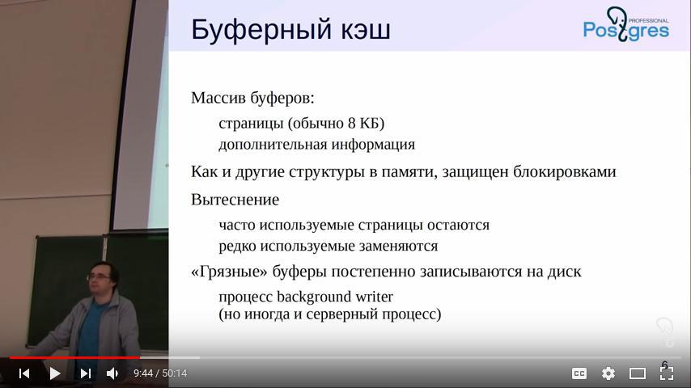

## 2. Архитектура

__Кластер__ несколько объединенных баз данных

__Табличное пространство__ каталог с файлами, где физически лежат данные таблиц и баз. Каждый файл в папке разбит по 1гб, потому что таблица/индекс не может превышать этот размер.

Есть специальное табличное пространство которое нельзя отнести к другим базам данных. К примеру таблица со списком всех баз данных в кластере. Такое табличное пространство называется глобальное табличное пространство и объекты из этого пространства видны в каждой базе как будто они там, рядом с остальными объектами базы лежат.

### Транзакции
Транзакция - это последовательность операций, составляющая логическую единицу работы.

Атомарность - все или ничего
    - при фиксации выполняются все операции
    - при откате не выполняется ни одна
Согласованность - целостность данных
    - система переходит из одного согласованного состояния в другое
Изоляция - от других транзакций
    - на результат не должны оказывать влияние другие параллельно работающие транзакции
Долговечность - даже после сбоя
    - зафиксированные изменения никогда не теряются

### Журнал Упреждающей Записи (WAL)
В WAL записывается информация, достаточная для повторного выполнения всех действий при восстановлении.
- Обязан попасть на диск раньше чем измененные страницы
    - процесс wal writer
- Записывается в момент фиксации, либо асинхронно
- Сохраняется в файлы (по 16 мб), старые могут архивироваться
    - процесс wal archiver
Контрольная точка - принудительный сброс на диск всех грязных буферов, чтобы не хранить много файлов
    - процесс checkpointer

### Многоверсионность (MVCC)
Каждая транзакция работает со снимком
    - согласованные данные на определенный момент времени
В страницах хранятся версии строк
    - при удалении старая версия строки остается в странице
    - при изменении остается старая версия и появляется новая
Периодически происходит очистка версий, не доступных больше ни в одном снимке
    - процесс autovacuum launcher/workers или вручную

### Расширяемость
Расширяемость заложена в архитектуре системы
Языки программирования
    SQL, PL/pgSQL, PL/Perl, PL/Python
Функции
Типы данных и операторы
Типы индексов и методы доступа
    GiST, GIN, SP-GiST
Обертки сторонних данных (FDW) механизм который позволяет получать данные извне субд (из другой базы данных, из файла)

## 5. Базы данных

Initdb создает три базы данных:
- template0 - шаблон базы, изменения не рекомендуются. из нее создаются базы при восстановлении а также используется для создания баз с кодировкой отличной от кодировки по-умолчанию.
- template1 - шаблон базы, из которой по умолчанию копируются другие, можно добавлять общие объекты и расширения
- postgres - база для подключений по умолчанию

> Новая база всегда создается клонированием существующей

## 6. Табличные пространства

Твбличные пространства это средство для организации физического хранения данных. Табличные пространства могут использоваться несколькими базами данных кластера. Каждая база данных имеет табличное пространство по умолчанию.

## 7. Системный каталог

Системный каталог это некая мета-информация которая хранится в самой базе данных и описывает что в ней есть. Находится в схеме `pg_catalog`. Кроме select from pg_catalog мы можем использовать команды psql

команды \d* [pattern]
- списки по типам объектов (\dt, \dv, \df)
- дополнительная информация - модификатор +
- системные объекты - модификатор S

Правила наименования таблиц и представлений системного каталога такие
- Название начинается с `pg_`
- Названия столбцов имеют трехбуквенный префикс, и он соответствует имени таблицы каталога
    - pg_proc - префикс 'pro'
    - pg_attribute - префикс 'att'
    - pg_namespace - префикс 'nsp'
    - pg_tablespace - префикс 'spc'
    - pg_class - префикс 'rel'

У каждой БД кластера свой набор таблиц системного каталога

8 глобальных для кластера БД таблиц
- базы данных `pg_database`
- табличные пространства `pg_tablespace`
- роли `pg_authid`, `pg_auth_members`
- настройки для ролей `pg_db_role_settings`
- шаблоны процедурных языков `pg_pltemplate`
- зависимости и описания для общих объектов `pg_shdepend`, `pg_shdescription` 