# DBA 2
> Коспект курса видеозаписей "DBA2. Администрирование PostgreSQL. Расширенный курс"
***
## 2. Устройство сервиса
Кластер в постгресе это несклько баз данных с которыми происходит работа.

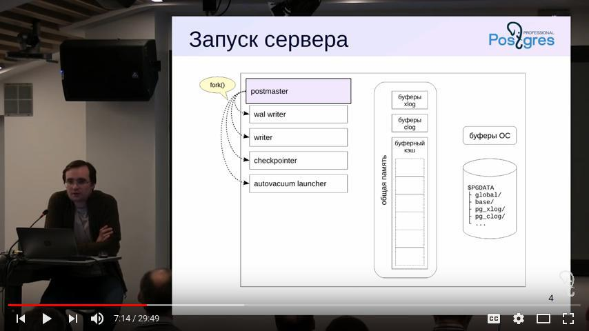

Процесс postmaster:
+ создает общую память
+ запускает процесс startup который знает что делать в случае сбоя и производит первоначальную инициализацию системы. процесс запускает видит что работа в прошлый раз была завершена нормально и заканчивает работу
+ запускает дополнительные процессы и смотрит за ними, перезапускает

Запущенные процессы которые будут висеть в фоне и работать с запущенным экземпляром
+ wal writer
+ background writer
+ checkpointer
+ autovacuum launcher

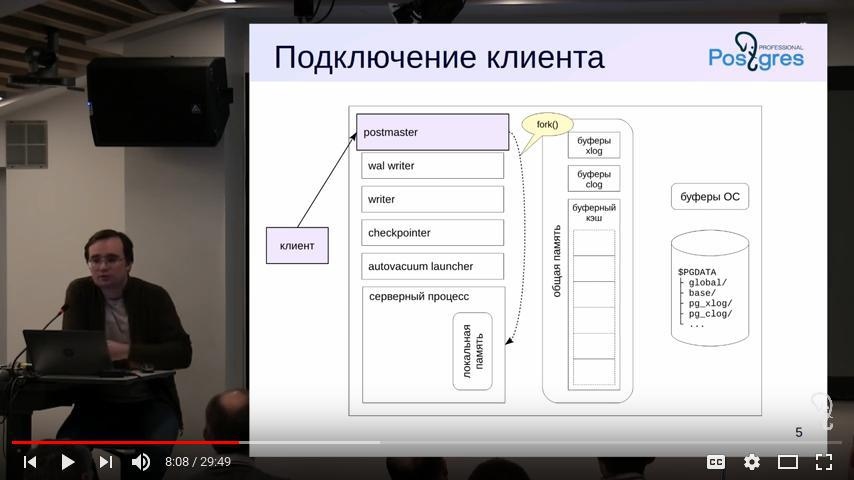

Когда клиент стучится к базе, первым принимает запрос постмастер, затем он порождает серверный процесс или бэкенд. Каждое входящее соедиение - это отдельный процесс которые запускает постмастер. Если много коротких входящих соедиений имеет смысл использовать пул запросов.

У каждого процесса есть своя локальная память и доступ к общей памяти всех процессов.

Далее клиент посылает запрос серверному процессу, происходит аутентификация у серверного процесса и он начинает принимать запросы.

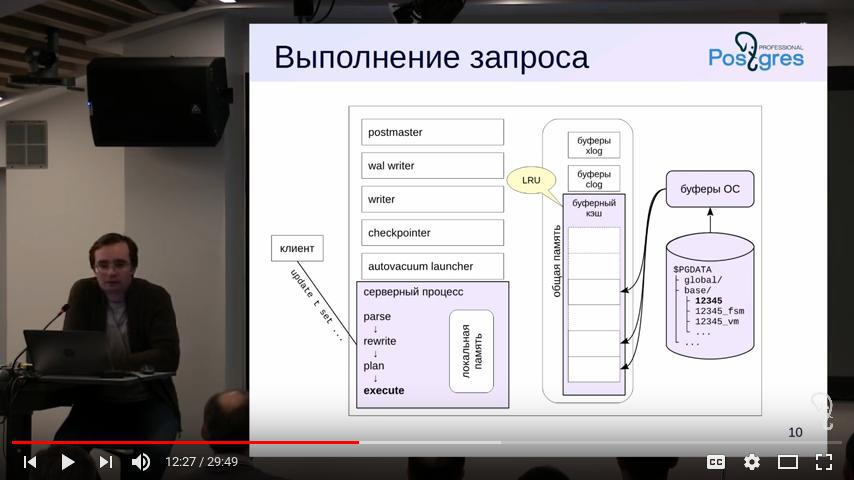

Выполнение запроса происходит в несколько этапов:
1. синтаксический и семантический разбор, строится дерево разбора
2. проверяется доступ к объектам из запроса, есть ли эти объекты в базе (ищет в системном каталоге). Сам системный каталог кешируется в локальной памяти серверного процесса
3. трансформация запроса (заменяет имена представлений из предзапроса)
4. оптимизатор перебирает планы выполнения запроса, оценивает (проставляет стоимость) и выбирает оптимальный. Входные данные для анализа это статистика которая собирается про объекты в базе данных - количество строк, распределение данных
5. план передается исполнителю
6. запрос начинает выполняться

Данные хранятся в файлах. Табличные пространства представляют собой каталоги и в этих каталогах хранятся файлы. Каждой таблице соответствуют несколько файлов, обычно три:
1. 12345
2. 12345_fsm
3. 12345_vm

Эти данные читаются через буферную систему ОС и попадают в буферный кэш постгреса. Буферный кэш это массив буферов. В буферный кэш кладется одна страница (8 килобайт по умолчанию) + доп инфо (из какого файла, состояние). Буферный кэш ограничен по размеру, для того чтобы вычистить данные которые используются реже чем другие.

Единственный способ работать с данными для постреса это прочитать страницу с диска, засунуть ее в буферный кэш, затем в буферном кэше с ними работать. Прежде чем менять данные в страницах, нужно поместить информацию о том что мы хотим сделать в __журнал упреждающей записи__ (WAL, write ahead log, transaction log, xlog). WAL необходим для восстановления после сбоя, буферный кэш исчезает при перезагрузке. Записанные транзакции можно накатить повторно и восстановить данные в случае сбоя.

Механизм многоверсионности (__MVCC__ - muti version concurrency control). Обеспечивает механизм наличия снимков одних и тех же данных. Каждая из транзакций работает с какой то версией данных, несколько транзакций могут работать с разными версиями одних и тех же данных. Позволяет избежать избыточной блокировки и повысить паралеллеизм процесса.

Информация в WAL попадает не сразу, сначала она попадает в специальные буфер в общей памяти. Далее отдается клиенту ответ при этом в буфере могут быть данные которые были изменены но на диск еще не попали. Специальный процесс __wal_writer__ отвечате за запись журнала на диск. Основная идея в том что данные в лог должны попасть на диск раньше, чем те страницы о которых упоминается в журнале.

Страницы в буферном кэше которые были изменены называются грязными. Есть специальный процесс __background_writer__ который время от времени записывает некоторые грязные страницы на диск, чтобы их освободить.

Буфер __clog__, commit log это фактически таблица в которой для каждой транзакции есть два бита, один для того чтобы пометить транзакцию как зафиксированную, второй, что транзакция откачена. Перед записью в этот буфер необходимо сообщить WAL о том что мы собираемся изменить транзакцию.

Транзакция должна фиксироваться сразу, для этого запускается процесс _fsinc_ который проверят что данные на диск записаны, дошли до энергонезависимого хранилища, т.к. буферы ос могут записать изменения на диск не сразу. После того как данные дошли до диска, коммит возвращает управление клиенту.

Процесс __checkpointer__, механизм контрольной точки. Нельзя сказать заранее какой размер журнала WAL нужно хранить, поэтому есть процедура контрольной точки которая гарантированно записывает все грязные, старые страницы на диск на тот момент когда она была запущена. После того как контрольная точка выполнена все журналы упреждающей записи которые до этого не было нам не нужны. Кроме того информация о том когда была записана контрольная точка записывается в файл __pg_control__ ($PGDATA/global/pg_control).

После того как клиент отключился, его процесс исчезает и в какой то момент пострес решает что ему нужно запустить __autovacuum__. Вычищает из страниц старые версии строчек. Процесс __autovacuum_launcher__ запускает через postmaster (только он может запускать процессы) несколько дочерних процессов __autovacuum_worker__

***
## 3. Уровни изоляций
__Транзакция__ - последовательность операций составляющая логическую единицу работы:

ACID
- __A__ Атомарность, все или ничего. При фиксации выполняются все операции, при откате не выполняется ни одна
- __C__ Согласованность - целостность данных, система переходит из одного состояния в другое
- __I__ Изоляция - от других транзакций. На результат не должны оказывать влияние другие параллельно работающие транзакции
- __D__ Долговечность - даже после сбоя. Зафиксированные изменения никогда не теряются

__Полная изоляция__ - результат параллельного выполнения нескольких транзакций совпадает с результатом их последовательного выполнения

Реализация полной изоляции очень сложная и стандартом SQL допускаются некоторые послабления. На каждом уровне изоляции есть допустимые аномалии

__Допустимые аномалии__
- _Грязное чтение_ Транзакция может "видеть" незафиксированные изменения в других транзакциях
- _Неповторяемое чтение_ Повторный запрос может показывать измененные строки
- _Фантомное чтение_ Повторный запрос может показывать новые строки

4 уровня изоляции по мере возрастания строгости:

- Read Uncommited
- Read Commited
- Repeatable Read
- Serializable (самый строгий)

По стандарту SQL

Уровень изоляции  | "Грязное" чтение | Неповторяемое чтение | Фантомное чтение |
----------------- | :--------------: | :------------------: | :--------------: |
| Read uncommited | да               | да                   | да               |
| Read commited   | -                | да                   | да               |
| Repeatable read | -                | -                    | да               |
| Serializable    | -                | -                    | -                |

На всех уровнях не допускается потеря зафиксированных изменений.

Отсутсвие всех трех феноменов не гарантирует полной изоляции.

Реализация в Postgres

Уровень изоляции  | "Грязное" чтение | Неповторяемое чтение | Фантомное чтение | Аномалии сериализации |
----------------- | :-------: | :-----------: | :-------: | :----------: |
| Read uncommited | __-__     | да            | да        | __да__       |
| Read commited   | -         | да            | да        | __да__       |
| Repeatable read | -         | -             | __-__     | __да__       |
| Serializable    | -         | -             | -         | __-__        |

Благодаря многоверсионности в пострегесе изначально "грязное" чтение не допускается. Repeatable read здесь это Serializable по стандарту SQL но с оговоркой что отсутствие всех этих аномалий не может гарантировать полную изоляцию.

Видимость данных внутри транзакции определяется тем в какой момент создается снимком данных.

На уровне __READ COMMITED__
- снимок данных создается каждый раз при старте каждой команды
- каждая команда транзакции "видит" изменения
- возможен несогласованный снимок данных (транзакция пытается обновить то что уже обновлено, попадает на блокировку, когда она снимается - видит несогласованный снимок данных)

Для уровня __REPEATABLE READ__ и __SERIALIZABLE__
- снимок создается перед выполнением первой команды транзакции
- все команды транзакции "видят" изменения зафиксированные на момент старта первой команды транзакции

__READ UNCOMMITED__
- "Грязное" чтение не допускается
- READ UNCOMMITED = READ COMMITED

Управление транзакциями:

В постреге есть параметр __default_transaction_isolation__, значение по умолчанию READ COMMITED

Чтобы явно управлять

```sql
=> BEGIN ISOLATION LEVEL READ COMMITED;
=> END
```
Посмотреть уровень текущей транзакции - параметр __transaction_isolation__

```sql
=> BEGIN;
=> SET TRANSACTION ISOLATION LEVEL READ UNCOMMITED;
=> SHOW transaction_isolation;
=> END
```

2-я транзакция видит только те изменения, которые были зафиксированны на момент старта очередного запроса к БД. Если во время выполнения долгой команды другая транзакция успела зафиксировать изменения, то они не будут видны

С одной стороны сторая транзакция не должна видеть все изменения на начало команды. Но если транзакция повисла на строке которую заняла другая транзакция и ждет разблокировки. Когда транзакция выходит после блокирования она вынуждена перечитать эту строку. Такое происходит только при блокировке.

Нужно помнить о том что при блокировке перечитывается только заблокированная строка. Пример с двумя транзакциями и статусами open/closed

***
## 4. Устройство страниц

Страница обычно размеро 8кб

Внутри страницы есть заголовок с описание того как на странице расположены данные, указалети адреса остальных разделов старницы.

Далее массив указателей на строчки которые находятся внутри страницы

Страницы таблицы и страницы индекса устроены одинаково. Что индекс что таблица в понимании постгреса почти одно и то же - некая штука которая состоит из страниц. Буферному кэшу неважно откуда мы эту страницу прочитали - из таблицы или из индекса.

Массив указателей это ссылка на версию строчки снутри странички и ее длина + несколько битов которые используются для статуса строки. Таким образом можно не переходя на строчку уже иметь какие то данные о ней.
- __offset__ версия строки
- __len__ длина строки
- __flags__ статус версии строки

Внутри строчки есть дополнительные специальные поля
- __xmin__ номер транзакции создавшей версию
- __xmac__ номер транзакции удалившей версию
- __infomask__ информационные биты
- __ctid__ указатель на след. версию той же строки
- сами данные

_xmin_ и _xmac_ задают тот промежутов времени в который эта версия строки актуальна

Каждая версия строки обязана целиком умещаться в странице
- часть полей может быть сжата
- часть полей может быть отправлена во внешнее TOAST(_The Oversized Attributes Storage Technic_)    хранилище

Внешнее хранилище это по сути еще одна таблица, но она служебная, ее можно увидеть в системном каталоге, она будет иметь имя __pg_toast_N__ и к ней будет создан индекс. В этой таблице эта строка будет порублена на такие кусочки чтобы они помещались внутри страницы. Когда мы обращаемся к такой строке постгрес обращается во внешнее хранилище, склеивает строку из кусочков и возвращает клиенту.

Преимущества такого подхода в том что если мы не обращаемся к такому значению которое не поместилось в основную таблицу то постгрес и не полезет во внешнее хранилище. За счет этого работать с таблицей можно эффективнее.

Не рекомендуется в серьезном приложении использовать '*' потому что она в том числе будет вытягивать длинные поля.

У TOAST-таблицы поддерживается собственная версионность. Если мы обновляем строчку в основной странице у нас появляется новая версия строки в которой дублируются все поля из этой строки, в том числе которые не менялись. Если мы не меняли длинное поле, то это длинное поле останется в TOAST-таблице неизменным, две версии строки в основной странице будут ссылатся на одну строку из TOAST-страницы. Это позволяет не раздувать размер таблицы.

Из минусов используя длинное поле приходится обращаться на самом деле к двум таблицам а не к одной.

Управление происходит на уровне отдельных столбцов и отдельных страниц. Есть параметры хранения которые можно поменять с помощью команды alter table, alter column

```sql
ALTER TABLE t ALTER COLUMN c SET STORAGE (PLAIN/EXTENDED/EXTERNAL/MAIN); 
```
Стратегии:
- __PLAIN__ запрещает и сжатие и внешнее хранение (прописана для всех полей которые имеют небольшой размер - числа, даты)
- __EXTENDED__ разрешает сжатие и внешнее хранение (используется по умолчанию для длинных полей)
- __EXTERNAL__ разрешает только внешнее хранение (не будет пытаться сжать)
- __MAIN__ в первую очередь сжатие (до упора пытается сжать и только если не получится отправит в хранилище)

### Страница индексов
Что находится в индексной странице

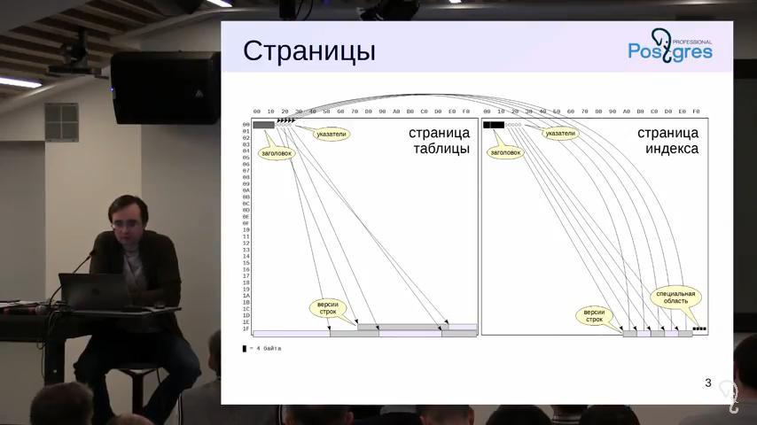

Указатели сверху:
- __offset__ указатель на версию строки
- __len__ длина строки
- __flags__ статус версии строки

Строки содержат и сильно зависят от типа индекса. Как правило есть всегда ссылка на строчку в таблице
- __ctid__ указатель на версию строки в таблице
- значения ключей индексирования (данные). Может входить проиндексированный ключ

Никакой индекс не содержит информацию о версионности. Вся информация о версии строки содержится только в самой таблице. Прочитав только индекс нельзя построить снимок, нужно читать и таблицу.

### Вставка данных

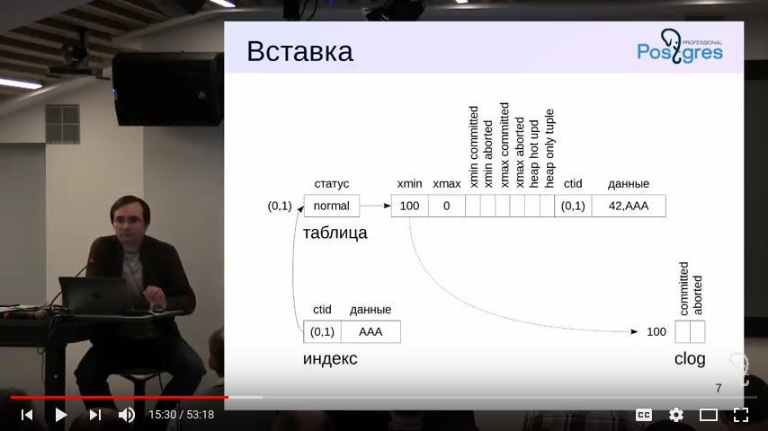

Когда мы вставляем строку появляется указатель, у него проставляется статус _normal_ и ссылается на строчку. В строчке проставляется номер транзакции который ее создал _xmin_=100, _xmax_=0 (строка действует по настоящее время). _ctid_ указывает сам на себя при вставке новой строки. Номер в указателе читается как (0,1) - номер страницы и номер строки внутри страницы.

В _clog_ зранится статусы транзакций, для 100 странзакции биты если сброшены то она сейчас идет, непонятно что в ней.

Есть параметр который можно задать при создании таблицы - __fillfactor__ определяет до какой пора постгрес будет пытаться добавить новые строчки в страницу. Изменяется в процентах - от 10 до 100. Если страница заполнена больше чем на _fillfactor_ новые строчки вставлять не будет а будет в новую страницу. Таким образом в странице остается некоторое свободное место которое может быть использовано следующими обновлениями. Будет полезно при __HOT UPDATE__

```sql
CREATE TABLE t with (fillfactor = 50);
```

Меньше (от 10%) | Больше (до 100%) |
--- | :---: |
| плотность ниже | плотность выше |
|таблица больше|таблица меньше|
|рекомендуется при частых обновлениях|рекомендуется при статичных данных (экономится место на диске)|

#### Фиксация изменений
Фиксация дешевая не считая _fsinc_, единственное что нужно сделать это в _clog_ поставить бит что транзакция зафиксированна. В казателе страницы чтобы не ходить в clog и проверять прошла ли транзакция строки есть 4 бита _xmin commited_, _xmin aborted_, _xmax commited_, _xmax aborted_, в которых проставляются статусы транзакций. При фиксации изменений данные заносятся только в clog, однако когда следующая транзакция начнет читать эту строку и пойдет смотреть в clog статус предыдущей странзакции проставит эти биты в указатель.

Если в одной транзакции будет вставка 1 000 000 строка а другая транзакция сделает select *, то в WAL посыпится куча изменений и будет идти запись на диск. Как раз за этого.

#### Откат
Тоже дешевая, нужно проставить в clog транзакцию как aborted

#### Обновление
Происходит создание новой строки, при этом старая строка закрывается (xmac = xmin новой строки), ctid старой строки меняется на ctid новой строки

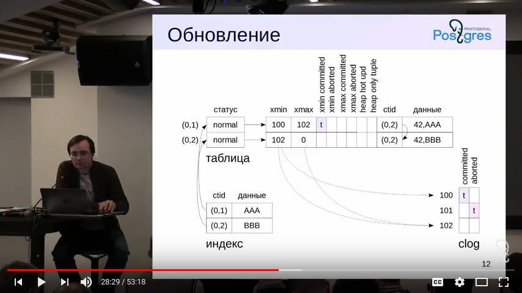

__Tuple__ версия строки в таблице
__Heap__ синоним таблицы

__Hot (_Heap Only Tuple_) Update__ Версия строки которая содержится только в странице и нигде больше.

В указателе ставятся два битика __heap hot upd__, __heap only tuple__, бит в первом случае означает что для индекса нужно пройти по ссылка на строки внутри этой таблицы, чтобы не создавать новые записи на странице индекса если менялось не проиндексированное значение в строке.

_HOT UPDATE_ Цепочка обновлений, которая строится в пределах одной страницы
- не требуется обращение к другим блокам, не ухудшается производительность
- если на странице не хватает места, цепочка обрывается (как если бы оптимизация не работала)
- уменьшение fillcator увеличивает шансы на оптимизацию

Для изучения структуры страницы и версий строк, можно воспользоваться расширением __pageinspect__

```sql
CREATE EXTENSION pageinspect;

CREATE VIEW t_v AS
    SELECT '(0,' || lp || ')' AS ctid,
        CASE lp_flags
            WHEN 0 THEN 'unused'
            WHEN 1 THEN 'normal'
            WHEN 2 THEN 'redirect to ' || lp_off
            WHEN 3 THEN 'dead'
        END AS state,
        t_xmin AS xmin,
        t_xmac AS xmac,
        CASE WHEN (t_infomask & 256) > 0 THEN 't' END AS xmin_commit,
        CASE WHEN (t_infomask & 512) > 0 THEN 't' END AS xmin_aborted,
        CASE WHEN (t_infomask & 1024) > 0 THEN 't' END AS xmax_commit,
        CASE WHEN (t_infomask & 2048) > 0 THEN 't' END AS xmax_aborted,
        CASE WHEN (t_infomask2 & 16384) > 0 THEN 't' END AS hhu,
        CASE WHEN (t_infomask2 & 32768) > 0 THEN 't' END AS hot,
        t_ctid
    FROM heap_page_items(get_raw_page('t', 0))
    ORDER BY lp;
```

Посмотреть номер текущей транзакции

```sql
select txid_current()
```

Похожую но менее детальную информацию можно вытащить и из самой таблицы
```sql
select xmin, xmax, * from t;
```

Точка сохранения. Как откатить только часть транзакции учитывая что в постгресе транзакция может быть либо закоммичена либо откачена. В постреге такая логика делается с помощью вложенных транзакций (sub transactions).

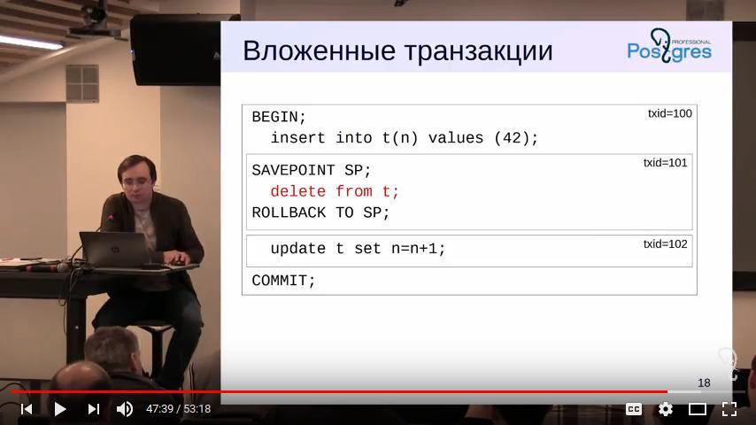

У вложенной транзакции:
- есть свой номер, который всегда больше номера основной транзакции
- собственный статус в clog. конечный статус зависит от статуса основной транзакции
- информация хранится на диске (`$PGDATA/pg_subtrans`) и данных кешируются в буферах аналогично clog

***
## 5. Снимки и блокировки

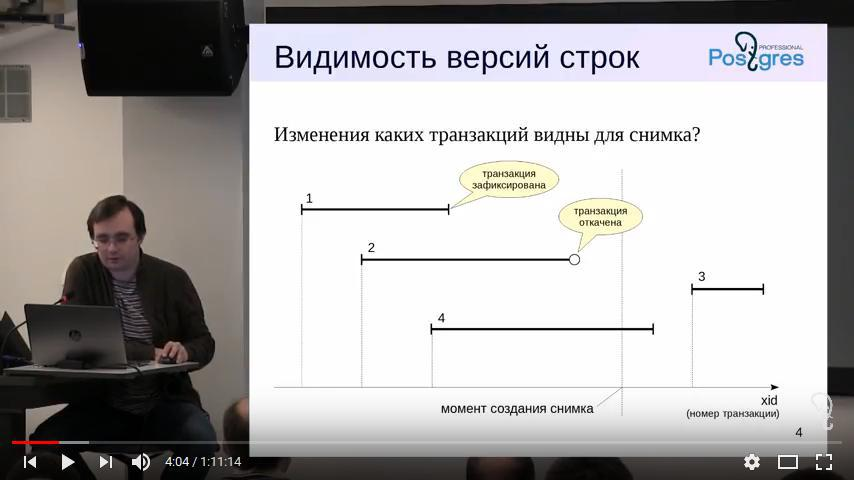

Видимость версии строки ограничена ее _xmin_ и _xmax_. Правила видимости довольно сложны, много тонких ситуаций. но если по простому то:

Версия попадает в снимок, когда:
- изменения транзакции xmin видны для снимка
- изменения транзакции xmax не видны для снимка

Изменения транзакции видны когда
- это та же самая транзакция что создала снимок, мы увидим их еще до создания снимка потому что они наши
- транзакция завершилась фиксацией до момента создания снимка

Для того чтобы создать снимок нужно знать список активных транзакций которые еще не завершились. По большому счету снимок в постгресе состоит из номера следующей (еще не существующей транзакции) и списка активных транзакций

Снимок создается:
- READ COMMITED - при выполнении каждого запроса
- REPEATABLE READ, SERIALIZABLE - при выполнении первого запроса в транзакции

> Снимок можно создать только на текущий момент времени

Как получить информацию о снимке

```sql
select txid_current_snapshot();
```

Эта функция возвращает такую таблицу

Минимальная транзакция|Номер транзакции который еще не выдан|Список активных транзакций|
--- | :---: | :---: |
|842682|842682||

Пострес экономит номера транзакций, быстро кончаются 32-битное число. Поскольку первая транзакция ничего не меняла а только смотрела то пострес считает что ей нормальный номер транзакции пока не нужен и создает виртуальный номерт транзакции. Транзакция не получает номер до того как начнет изменять данные.

```sql
SELECT virtualxid, mode
    FROM pg_locks
    WHERE pid = pg_packend_pid() AND locktype = 'virtualxid';
```

Виртуальный номер состоит из двух частей - номера серверного процесса и уникального номера в пределах этого процесса.

Но если выхвать функцию `txid_current()` то номер для транзакции выделится

Иногда бывает важно чтобы несколько транзакций видели одну и ту же картину мира. Классический пример - утилита pg_dump которая делает резервную копию базы данных в несколько потоков. Для этого в постгресе есть механизм экспорта и импорта снимков

Механизм экспорта снимка
- одна транзакция экспортирует снимок `pg_export_snapshot()`
- другие транзакции используют этот снимок `set transaction snapshot <ID>`

> __Ограничения__: снимок существует, пока активна создавшая его транзакция

За счет многоверсионности у нас получается выйгрыш в том что транзакции редко когда друг друга блокируют. Читающая транзакция никогда не заблокирует изменяющую, изменяющая никогда не заблокирует читающую. Но блокировки должны быть при двух транзакциях изменяющих данные.

Блокировки важная часть механизма изоляции.

Блокировки возникают
- при удалении
- или обновлении строк
- при явном блокировании (`select for share/update`)

Для вставки блокировки не нужны по той простой причине что строки вставленные другими транзакциями просто не будут видны другой транзакции до того как изменения зафиксированны.

Устройство блокировки
- используется поле `xmax` содержащее номер активной блокирующей транзакции, как при удалении однако есть специальный бит который указывает что это не просто удаление а блокировка
- количество блокировок ничем не ограничено, большое число блокировок не приводит к потере производительности. Это просто отметки внутри страницы

Select for share/update это разделяемая блокировка и смысл ее в том, что у нас несколько транзакций могут захватить блокировку одной и той же строки.

Кроме блокировок на уровне строк есть __блокировки на уровне объектов БД__. Они нужны в основном для того чтобы команды DDL и DRM друг другу не мешали. Они возникают:
- при любых операциях с таблицами
- а также индексами, представлениями, последовательностями
- при явном блокировании

Такая блокировка например может запретить создавать индекс пока мы не внесли какие-то изменения в таблицу. Или при чтении таблицы всегда ставится блокировка защищающая ее от того что кто то захотел удалить таблицу.

Блокировки на уровне БД защищают (в зависимости от режима)
- от изменения определения или данных объекта при его использовании
- от использования изменяющегося объекта

Устройство блокировок на уровне БД
- информация в общей памяти сервера (представление `pg_locks`), в отличие от блокировок строк
- ждущие процессы не потребляют ресурсы
- количество таких блокировок ограничено: `max_lock_per_transaction`(не ограничивает число блокировок на транзакция а общее количество блокировок объектов в одном подключении) * `max_connections` = пул блокировок

Блокировки на уровне Serializable
- отдельные предикатные блокировки на уровне таблицы или страницы индекса
- изоляция достигается не блокированием, а отслеживанием зависимостей, которые могут привести к нарушению
- количество предикатных блокировок также ограничено `max_lock_per_transaction * max_connections`

> Предикатные блокировки это способ отслеживания зависимостей между транзакциями по чтению и изменению данных. Такие блокировки ставятся на уровне страниц либо таблицы целиком

Взаимные блокировки это цикличные зависимости. Цикл ожидания который никогда не завершится. В такой ситуации постгрес ждет некоторое время при первой блокировке, но если в течении `deadlock timeout` блокировка не снялась, то посгрес строит граф ожидания, ищет петлю, и если находит то выбирает транзакцию-жертву и ее убивает, изменения по ней откатываются. Обычно возникновение взаимных блокировок индексирует о том что есть проблемы с приложением.

### Мониторинг блокировок

Запросы для изучения текущих блокировок можно изучить на основе представления `pg_locks` и `pg_stat_activity`

> Параметр `log_lock_waits` выводит сообщение об ожидании больше `deadlock timeout` в журнал сервера

Расширение `pgrowlocks` позволяет удобно посмотреть на блокировку. Функции нужно передать название таблицы.

```sql
CREATE EXTENSION IF NOT EXISTS pgrowlocks;
SELECT * FROM pgrowlocks('block');
```

locked_row | locker | multi | xids | models | pids |
--- | :---: | :---: | :---: | :---: | :---: |
|(0, 1)|842689|f|{842589}|{"No Key Update"}|{149918}|

Три режима блокировок:
- No Key Update
- No Key Share
- Share

Сделаны для того чтобы можно было независимо читать и изменять разные строки таблицы

Кроме блокировки строки тот факт что одна транзакция заблокирована другой отмечается в блокировке высокого уровня

```sql
SELECT transactionid, pid, mode, granted
    FROM pg_locks
    WHERE locktype = 'transactionid';
```

transactionid | pid | mode | granted |
--- | :---: | :---: | :---: |
|842609 |14931|ShareLock|f|
|842690|14931|ExclusiveLock|t|
|842689|14918|ExclusiveLock|t|

Когда появляется транзакция она сразу вешает эксклюзивную блокировку своего номера, а когда пострес хочет какую-то транзакцию подвесить. Механизм блокировки.

Существую как эксклюзивные блокировки строки (for update, for no key update) так и разделяемые (for key share, for share). В случае разделяемой блокировки одна строка может быть заблокирована несколькими транзакциями одновременно.

```sql
SELECT * FROM block FOR SHARE;
```
> При запросе представления `pg_locks` также ставится блокировка на эту таблиц

Блокировок на уровне таблиц у постреса есть восемь различных режимов:
- __AccessShareLock__ не позволяет добавить в таблицу столбец но позволяет удалять строчки, читать
- __RowExclusiveLock__ блокировка появляется при изменении таблицы, эта блокировка более жетская? не даст создать индекс пока эта блокировка не снимется

***
## 6. Очистка
Типы очисток:
- Внутристраничная очистка
- Очистка при HOT-обновлениях
- Очистка вручную (vacuum)
- Полная очистка (vacuum full)

Основная задача очисти - вычистить из страницы те версии строк которые уже не видны ни в одном снимке.

### Внутристраничная очистка
Быстрая очистка, которая выполняет изрядную долю работу. Может вызываться при любом обращении к странице (чтение/изменение не важно) но она выполняется не всегда, а только когда постгрес видит в этом какой то смысл. Смыс появляется тогда когда место на странице заканчивается (страница заполнена больше чем на __fillfactor__ либо для вставки новых данных нет места).

- Выполняется при любом обращении к странице
    - если ранее выполненное обновление не нашло места на странице
    - если страница заполнена больше чем на fillfactor
- Очищает старые версии строк, но не указатели
    - так как на них могу ссылаться индексы
- Не обновляет карту свободного пространства
    - освобождается место для обновлений
    - но новые строки не будут попадать на эту страницу
- Не обновляет карту видимости

Карты свободного пространства и карта видимости не обновляется по нескольким причинам
1. для экономии ресурсов (трудозатратная операция)
2. Не сообщаем всем о том что место освободилось и встави не будут происходить в эту страницу на место удаленной записи и очищенное место будет использоваться только для обновления данных но не добавления новых

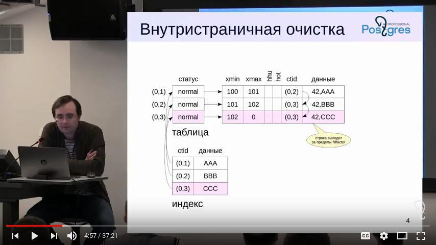

Указатель при очистке строки не удаляется но есму ставится статус _dead_ это значит что он никуда не ведет. Если придем по индексу на этот указатель но индекс поймет что данных нет.

Внутристраничная очистка хороша тем что она работает быстро, эффективно. Не может трогать указатели но указатели имеют небольшой размер и ничего страшного в этом нет. Основной недостаток в том что мы не можем чистить индексы.

Специальный случай внутристраничной очистки - это очистка при <abbr title="Heap Only Tuple">HOT</abbr> обновлении. При HOT обновлении из индекса идет один указатель на версию страницы из индекса а дальше внутри страницы поддерживается список версий. В таком случае указателю ставится статус _redirect_.

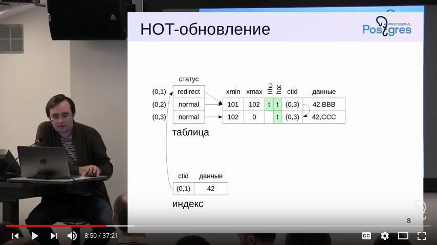

Таким образом внутри одной страницы можно делать много обноалений и при этом не потребуется для этого много места.

### Ручная очистка
Вакуум пробегает по траницам не только таблицы но и всех индексов на которых эти страницы есть. и страницу за страницей вычищает старые версии строк. Поскольку он работает и со страницей и со страницей индексов то он может удалять указатели. Соответствующим образом и перестраивая соответствующие индексные странички тоже. За счет этого вакуум может освободить больше места чем внутристраничная очистка. Вакуум походится не по всей таблице, он использует карту видимости для того чтобы выбрать те страницы на которых для него может найтись работа. В карте видимоти отмечены те страницы на которых строки достаточно старые (видны во всех возможных снимках). Вакууму на таких страницах делать нечего. Он проходится только по тем страницам которые в карте видимости не помечены и если он их вычищает и в них не остается ничего лишнего то он в карте видимости ставит отметку о том что эта страница будет видна всем и всегда.

- Выполняется при ручном запуске VACUUM
    - для отдельных страниц таблицы и соотвтетствующих индексов
    - не рассматривает страницы, отмеченные в карте видимости
- Очищает старые версии строк
    - но только те что еще не прошли внутристраничную очистку
- Очищает указатели
    - так как одновременно очищает и индексные страницы
- Обновляет карту свободного пространства
    - освобождается место и для обновлений, и для новых строк
- Обновляет карту видимости

Недостатки вакуума в том что он работает постранично. При огромном размере страницы после ваккума размер файла не уменьшиться потому что для вакуума нужно чтобы в конце таблицы было несколько пустых страниц, тогда он может их удалить. Ввнутри файла появится свободное место, но сам размер файла не уменьшится. Поэтому иногда нужно выполнять полную очистку.

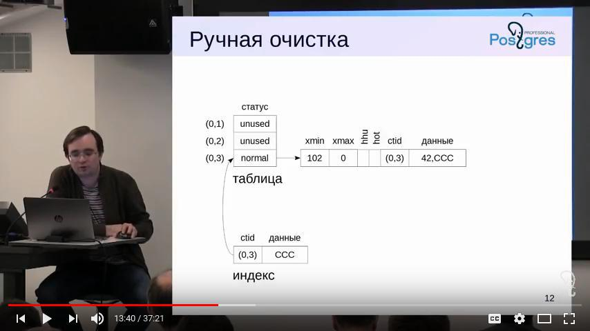

Указатели со статусом _unused_ потом могут быть переиспользованы например при добавлении новой строчки.

Когда вакуум работает, он создает определенную нагрузку на систему. Начинает перелапачивать таблицу. Этой нагрузкой нужно уметь управлять чтобы она не воздействовала на основную систему. Для этого у вакуума есть несколько параметров.

Процесс чередует работу и ожидание
- примерно vacuum_cost_limit условных единиц работы
- потом засыпает на vacuum_cost_delay мс

Настройки:
- vacuum_cost_limit = 200
- vacuum_cost_delay = 0 ms
_стоимость обработки_ условные единицы работы для разных работ
- vacuum_cost_page_hit = 1 (страницы в кэше)
- vacuum_cost_page_miss = 10 (страницы на диске)
- vacuum_cost_page_dirty = 20 (грязной страницы)

### Полная очистка
Когда страница выросла до таких размеров с которыми вы не готовы работать. `VACUUM FULL`. Хотя команда и называется вакуум но работает совершенно по-другому. Она перестраивает с нуля и таблицу и ее индексы. При этом таблица получается максимально компактная. Проблема только в том, что эта операция требует эксклюзивную блокировку на таблицу. Это значит что все запросы которые работают должны завершиться, после этого начнет выполнятся vacuum full, которая займет немалое время.

- Выполняется при ручном запуске VACUUM FULL
- Полностью перестраивает таблицу
    - Перестраивает также все индексы на таблице
    - Освобожденное место возвращается операционной системе
    - Выполняется дольше, чем обычная очистка
- Требует эксклюзивной блокировки

***
## Автоочистка и заморозка
Работет аналогично ручной очистке.
Чем автоматическая очистка лучше ручной:
- Он умеет работать в зависимости от количества изменившихся данных

Выполняется автоматически
- для таблиц с определенным количеством изменений
- в том числе для TOAST-таблиц

В системе всегда будет присутствовать процесс `autovacuum_launcher`
- Постоянно запущен
- Планирует запуск рабочих процессов

Процессы autovacuum worker
- запускаются процессом postmaster по просьбе autovacuum launcher
- подключаются к заданной БД, перебирают и очищают таблицы

Как работает Autovacuum launcher. Он знает какие базы данных нужно очищать - по базам данных собирается статистика использования. Если в базе данных что то происходит то он считает что нужно запустить очистку. Он настроен так, чтобы запускаться каждые `autovacuum_naptime` секунд. Если несколько активных баз данных, то воркеры будут запускаться чаще, так чтобы каждой базе через определенный naptime доставался воркер. При этом количество воркеров ограничено параметром `autovacuum_max_workers`

Алгоритм работы:
- Для каждой базы данныз (в которой есть активность)
- Запускать рабочий процесс раз в `autovacuum_naptime`
- Количество рабочих процессов <= `autovacuum_max_workers`

Настройки:
- autovacuum = on
- track_counts = on (включение сбора статистики сбора данных о активности таблиц)
- autovacuum_naptime = 60s
- autovacuum_max_workers = 3 (количество одновременно обрабатываемых таблиц)

Как работает дочерний процесс очистки `autovacuum worker`

Алгоритм
- выполнять по очереди очистку всех таблиц (включая TOAST)
- в которых число ненужных версий строк превышает `autovacuum_vacuum_thrueshold` + `autovacuum_vacuum_scale_factor` * число строк в таблице
- а также выполнять анализ всех таблиц, в которых число изменившихся версий строк превышает `autovacuum_analyze_threshold` + `autovacuum_analyze_scale_factor` * число строк в таблице. данные этого анализа затем используются и оптимизатором в том числе
- в одной БД могут параллельно работать несколько процессов

autovacuum_vacuum_threshold - абсолютное количество строк которое должны измениться
autovacuum_vacuum_scale_factor - доля строк которые должны измениться

Настройки очистки:
- autovacuum_vacuum_threshold = 50
- autovacuum_vacuum_scale_factor = 0.2 (20% таблицы должно поменяться чтобы началась автоочистка)
_эти два параметра определяют какие таблицы надо очищать_

### Переполнение счетчика транзакций (repr round ?)
Счетчик транзакций в постгресе имеет размер 32 бита, это довольно много 4 млрд, но если система достаточно нагружена, можно за этот диапазон выйти. Нельзя просто сбровить счетчик транзакций в 0 потому что пострес полагается на номера транзакций при работе со снимками - если номер транзакции меньше что считается что событие произошло раньше, если больше - то событие произошло позже.
Чтобы этого не происходило в постресе пространство идентификатора транзакций закальцовано таким образом, что в бужущем считается половина транзакций (2 млрд) и 2 млд в прошлом и по мере выделения новых номеров транзакций этот круг поварачивается.

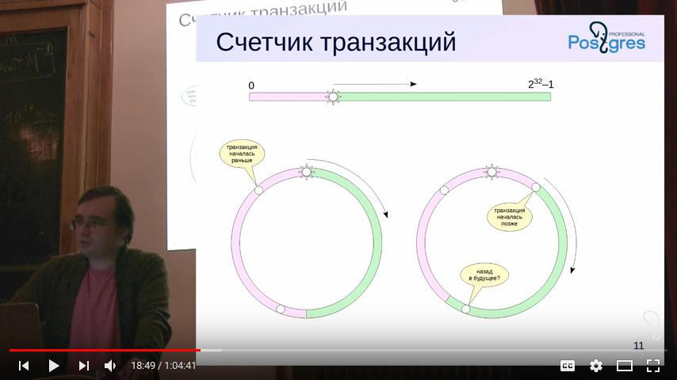

Для того чтобы очень старые номера транзакций не стали считаться в будущем пострес делает так называемую заморозку. Время от времени автовакуум проходится по транзакциям, по версиям строк и помечает те транзакции которые являются совсем старыми. Они должны быть гарантированно видимы во всех снимках а лучше еще старше. Когда транзакция помечена замороженой, она всегда считается в прошлом независимо от того какой у нее номер.

Как отмечается замороженная транзакция
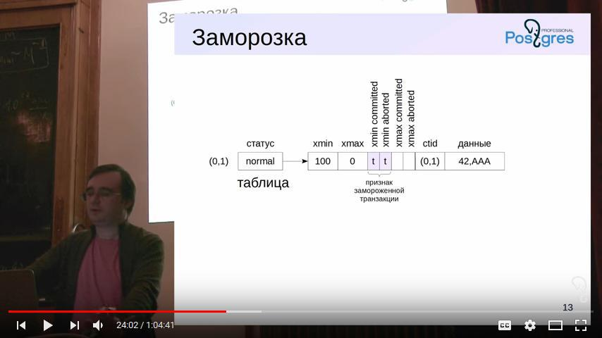

Параметры заморозки
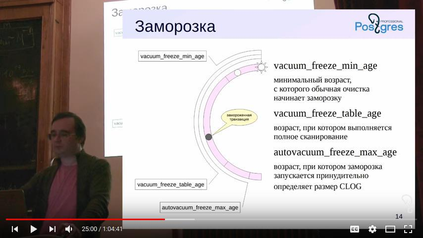

***
## 7. Буферный кэш
Блоки на уровне строк, таблиц, других объектов. Это тяжеловесные блокировки. Они умеют поддерживать список желающих получить доступ, поддерживают режимы работы, механизм отслеживания режимов взаимоблокировок. Но когда мы работаем с объектами в памяти нам тоже нужны блокировки потому что может также возникнуть ситуация что есть несколько процессов которые одновременно обращаются к одному месту в памяти. Поэтому структуры данных в оперативной памяти тоже защищаются блокировками. Таких блокировок в постгресе есть две разновидности.

Спин-блокировки (spinlock). Устрона на основе атомарных операций поддерживаемых процессором. Фактически это цикл активного ожидания. процесс пытается захватить блокировку, если не получается - засыпает на определенное время. Используются они в тех случаях когда мы не ожидаем, что у  нас будет очеьн много одновременных обращений в эту область. И надеемся что блокировка снимется быстро. 
- очень короткое время (несоклько команд процесса)
- цикл активного ожидания

Легковесные блокировки
- Устанавливаются на больший промежуток времени чем Спин-блокировки, но тоже небольшой. Обычно на то время которое нам нужно чтобы поработать с какой-то структурой данных
- эксклюзивные (блокировка для записи) или разделяемые (чтение). Можно захватить одну и ту же блокирку на чтение несколько раз, но если мы хотим записать то эта блокировка не должна быть больше никем захвачена.
- очередь ждущих (здесь активного ожидания нет, процесс которому нужно работать засыпает до тех пор пока его не разбудят когда придет его очередь)
- нет обнаружения взаимоблокировок. Более упрощенный механизм.

Конечный пользователь таких блокировок не видит, заметить это можно только если распараллеливание работает не так хорошо как хотелось.

Буферный кэш - это набор буферов. Каждый буфер - это место под страницу данных + некий заголовок с дополнительной информацией. Как минимум откуда этот буфер пришел (из какого файла, какая страница). Размер буферного кэша ограничен параметром `shared_buffers`, если размер страницы 8кб, то умножив размер страницы на shared_buffers мы получим занимаемый объем памяти.

Поддерживается список свободных буферов, тех которые не заполнены еще никакими данными. Свободные буферы быстро заканчиваются по мере работы системы. Но изначально такой список есть. Есть специальный указатель и связка свободных буферов.

В заголовке есть важные параметры
- usage_count это число которое увеличивается на 1 каждый раз когда мы обращаемся к буферу. оно показывает как активно мы работает со страницей
- признак грязного буфера. Страница данных которую мы уже поменяли но на диск еще не записали.

Чтение страницы из кэша
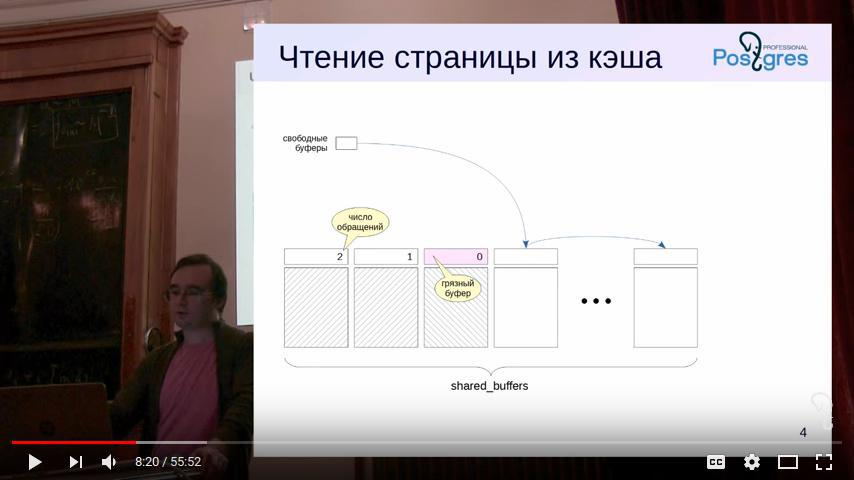
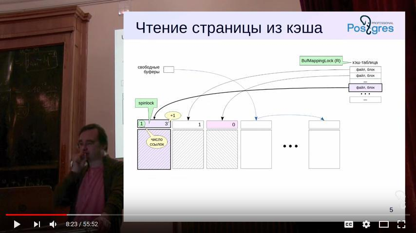

Есть хэш-таблица, у которой ключи - номер файла и номер блока, значение - номер буфера в буферном кэше. Для того чтобы прочитать эту таблицу надо захватить специальную блокировку `BuffMappingLock` на чтение. Если удается то ищем там номер файла и номер блока. Это дает нам ссылку на нужный буфер в буферном кэше. Чтобы поработать с буфером нужно увеличить счетчик использования на единичку, далее надо этот буфер запинить `pin_count`, чилос ссылок на этот буфер. Все эти значение храняться в заглоовке. Чтобы его прочитать надо захватить блокировку на него - `spinlock` на изменение. Теперь можно с этим буфером работать - скидываются все блокировки, остается только pin. Чтобы этот буфер захватить тоже нужно захватить блокировку `BufContent` (можно на чтение или на запись). После того как поработали должны отпустить.

Если в буферном кэше нужной нам страницы нет. Нужна блокировка на хэ-таблицу, выяснили что нет. Тогда ищется свободный буфер чтобы прочитать страницу с диска. Для этого используется указатель свободные буферы, чтобы его прочитать нужно взять блокировку `BufFreeList` в эксклюзивном редиме. Выбранный свободный буфер нужно запинить чтобы показать что мы с ним собираемся работать.

Чтобы прочитать данные с диска нужно захватить блокировку `BufContent` в эксклюзивном режиме, чтобы показать что мы будем менять содержимое и еще одну эксклюзивную блокировку `IOInProgress`. Это блокировка на которую вешатся процессы которые тоже хотят поработать с этими блоками. и в хэш таблицу надо запиать ссылка на страницу которую мы должны прочитать.

Когда все свободные буферы заняты а нам нужно прочитать страницу с диска, нужно использовать алгоритм вытиснения. Здесь вступает в силу указатель "следующая жертва". Это указатель на буфер который мы будем вытеснять. У этого указателя есть своя блокировка `BufFreeList`, указывает он на буфер и решаем можем мы его использовать или нет.

Чтение с вытеснением
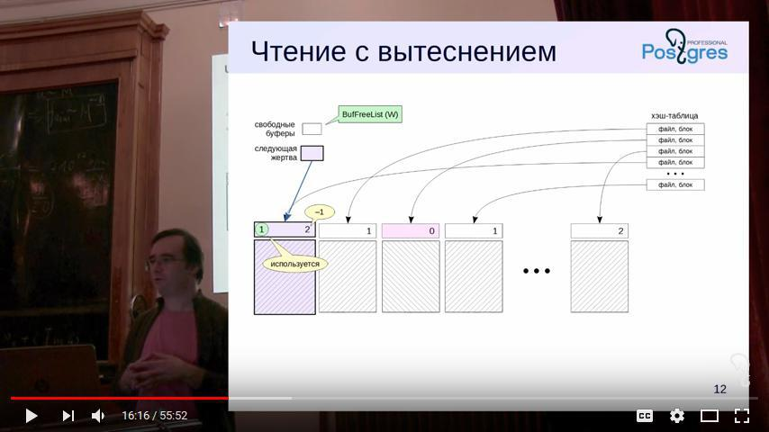
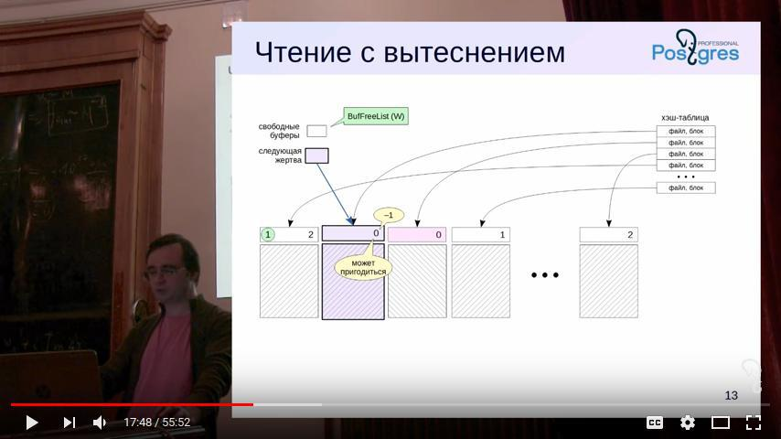
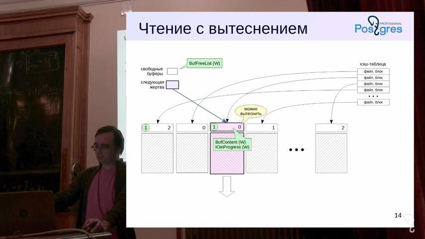

Если буфер который мы вытесняем грязный - мы его сначала должны записать на диск. После этого можно записать новые данные в этот буфер и поменять ссылку в хэш-таблице. А также указатель "следующая жертва" ставится на следующий буфер. Этот указатель перемещается по замкнутому кругу буферов. За один проход указателя наш записанный буфер должен нарастить счетчик использования иначе он будет вытеснен.

### Процесс фоновой записи
Идея в том чтобы разгрузить процессы от записи измененым страниц на диск. Процесс задуман так, чтобы немного опережать алгоритм вытеснения и записывать те данные которые вот вот будут вытеснены. У него есть свой указатель, назовем его "следующий на очистку". Этот указатель синхронизирован с указателем на следующую жертву. он никогда не может запаздывать, но может опережать. Работает он по тому же самому алгоритму - мы находим те буферные кэши которые не запинены, те у которых счетчик использвоания 0 и их записывааем на диск.

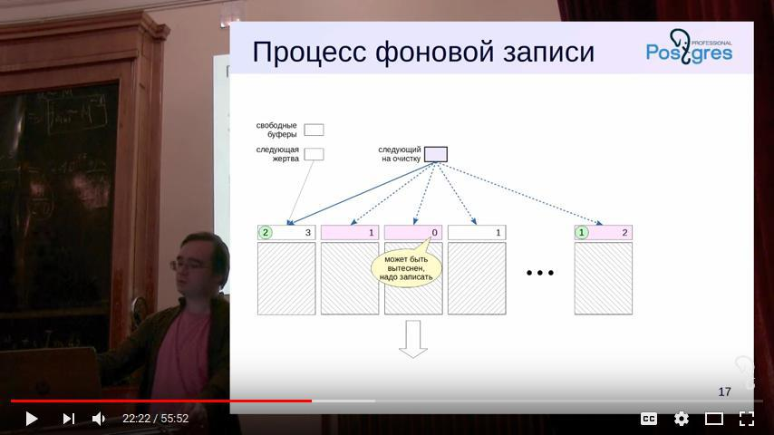

Алгоритм:
- записать столько грязных буферов, сколько буферов было запрошено серверными процессами с прошлого раза * `bgwriter_lru_multiplier` (но не больше `bgwriter_lru_maxpages`)
- уснуть на `bgwriter_delay` (но если совсем не было работы то дольше)

Настройки:
- bgwriter_delay = 200ms
- bgwriter_lru_maxpages (максимальное число страниц которое он записывает за один прием) = 100
- bgwriter_lru_multiplier = 2.0

Массовое вытеснение

Бывают ситуации когда нужно поработать с большой таблицей, сделать последовательное чтение всех ее страниц. Все это надо прочитать в буферный кэш. Таким образом можно вытеснить все полезные данные которые в этом буферном кэше были. Для таких случаев используется специальное буферное кольцо. От обзего буферного кэша отделяется какое-то количество буферов и устраивается мини-буферный кэш с собственным алгоритмом вытеснения внутри него и тем самым, когда мы будем читать большую страницу внутри него, она будет читаться только в пределах буферного кольца. 

Размер буферного кольца различается в зависимости от ситуации

Операция                       | Размер (страницы) | Грязные буферы        |
------------------------------ | :---------------: | :-------------------: |
| последовательное чтение      | 32                | исключаются из кольца |
| очистка (VACUUM)             | 32                | вытесняются на диск   |
| массовая запись (COPY, CTAS) | <=2048            | вытесняются на диск   |

Временные таблицы. видны одному сеансу. Их нет смысла помещать в буферный кэш. Кроме того они не поадают в вал и не надо создавать контрольные точки.

Для них используется специальный локальный буферный кэш, который находится в памяти того процесса который с ней работает а не в общей памяти. Он устроен проще:
- не требуются блокировки (только один процесс работает с таблицей)
- память выделяется не вся сразу. а постепенно по необходимости и ограниче  в пределах temp_buffers
- обычный алгоритм вытеснения, но без фонового режима

***
## 8. WAL Журнал упреждающей записи
Основная задача журнала это __возможность восстановления сограсованности данных после сбоя__

Механизм
- при изменении данных действие также записывается в журнал
- журнальная запись попадает на диск раньше измененных данных
- процесс упреждающей записи wal writer
- при сбое происходит повторное выполнение операций из журнала если это необходимо

Другие применения
- непрерывное архивирование, восстановление на произвольный момент
- физическая репликация и горячий резерв (журналы можно передавать на другой сервер и там сразу же их проигрывать)
- логическая репликация (можно записывать дополнительную инормация, после этого можжно декодировать какие операции выполнялись)

Что защищено журналом:
1. Изменение любых страниц в буферном кэше (кэш это штука в памяти которая может пропасть)
    - в том числе страницы таблиц и индексов
    - кроме нежурналируемых и временных таблиц
    - кроме hash-индексов
2. Фиксация транзакций (<abbr title="табличка в которой записаны статусы транзакций">CLOG</abbr>)
    - отмена не записывается в журнал (если мы будем восстанавливаться и у нас не будет записи что транзакция зафиксированна, она будет считаться отмененной)
3. Файловые операции
    - создание и удаление файлов
    - создание и удаление каталогов

Устройство журнала
1. Логическое
    - последовательность записей, могут иметь разную длину, внутри находится информация о действии. НАпример если мы вставляем какую-нибудь строчку то в журнал должна попасть эта строка целиком, если удалить - только запись о том что надо удалить строку.
    - записи защищены CRC (контрольной суммой)
    - указатель на запись - LSN (log sequence number, это 64-битное число) и для работы с ним в посгресе есть специальный тип `pg_lsn`
2. В памяти
    - разбит на страницы, страницы имеют такой же размер как страницы с данными
    - кольцевой буферный кэш (_wal_buffers_) предназначен только для журнала. С журналом работа идет в одну сторону, всегда только дописываем. Соответственно есть вытеснение и блокировки.

функция `pg_current_xlog_insert_location()` генерирует номер LSN

Пример записи транзакции
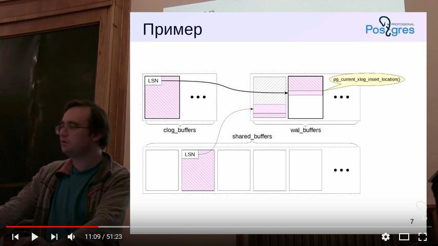

Есть несколько факторов которые влияют на надежность записей
1. Кэширование
    - данные должны дойти до энергонезависимого хранилища через кэши операционной системы, контроллера со своим кэшем, диска со своим кэшем. Нужно гарантировать что данные дойдут до хранилища а не застрянут в каком-либо кэше.
    - Постгрес полностью полагает на ОС в вопросе записи на диск, поэтому все что можно сделать это настроить способ синхронизации `wal_sync_method`. Для выбора лучшего способа есть утилита `pg_test_fsync`, но в любом случае - дорогая операция
    - журнал следует размещать на отдельной файловой системе, чтобы процесс синхронизации не тормозил остальной ввод-вывод
    - если контроллер использует кэш, должна быть батарейка
    - кэш диска на запись как правило стоит отключать
2. Повреждение данных
    - записи журнала защищены CRC
    - можно включить контрольные суммы страниц (только при инициализации кластера `initdb -k`) от сбоя не спасет но обнаружите что что то пошло не так
3. Атомарность записи страниц. Страница 8кб, операционнная система гарантирует атомарность записи только при 128 байтах. Может в случае сбоя записаться только полстраницы. Чтобы с этим справится у постгреса есть параметр `full_page_writes` который по умолчанию ключен. После контрольной точки, при первом изменении страницы вся страница записывается в журнал. и при восстановлении страница считывается из журнала и потом к ней применяются нужные операции. Это гарантирует то что страница не будет записана на половину.
    - запись образа страницы в журнал при первом изменении после контрольной точки
    - некоторые файловые системы могут гарантировать атомарность

Настройки
- fsync = on (при выключенном fsync не гарантируется целостность данных) такой параметр полезен если при миграции нужно залить терабайт данных, fsync можно отключить на время
- wal_sync_method
- full_page_writes = on
- wal_compression = off (сжатие образа страницы, с версии 9.5)
- wal_log_hints = off (on подразумевается при контрольных суммах)

Журнал может записываться в одном из двух режимов - синхронном либо асинхронном. В синхронном режиме мы работаем есели включен параметр `synchronous_commit` либо в том случае если нужно записать страничку с данными а соответствующая запись LSN еще не попала на диск.

Пострес немножко ждет `commit_delay` с той целью подсобрать изменения от других транзакций. Если есть шанс что другие транзакции скоро зафиксируются то хорошо бы зафиксировать за один прием. Будет ждать только есть есть активные транзакции. Минимальное количество активных транзакций определяется параметром `commit_siblings`.

После периода ожидания журнал записывается до того LSN в котором мы заинтересованы либо записывается дальше если успели приосседиться транзакции. И только после того изменения зафиксированны, команда commit возвращает нам управление.

Алгоритм:
- при фиксации изменений, если включен `synchronous_commit` а также перед записью страницы, если запись LSN еще не на диске: ждет `commit_delay`, если активно не менее `commit_siblings` транзакций записывает журнал до необходимого LSN

> WAL гарантирует долговечность но уменьшает производительность

Настройки:
 - syncronous_commit = on
 - commit_delay = 0
 - commit_syblings = 5

Если мы не хотим ждать, то можем воспользоваться асинхронным режимом. Асинхронный режим работает циклами записей. Цикл повторяется через определенное время, которое настраивается параметром `wal_writer_delay`, после этого происходит запись. Записываются целиком заполненные страницы, которые заполнились с предыдущего момента записи. Но, если с предыдущего момента ни одна страница не была заполнена полностью, то wal writer запишет этот кусочек. Это работает быстрее, но зафиксированные изменения могут пропасть. Окно в которое не гарантируются сохранность изменений = 3 * `wal_writer_delay`. Почему 3 - wal записывает полные страницы, но буфер кольцевой. За первый заход он пишет страницы с текущей до конца буфера, во второй от начала буфера до какой то позиции и третий - частично заполненную страницу. Тем не менее целостность данных гарантируется, даже при потерянной транзакции.

> Параметр `synchronous_commit` можно устанавливать на лету, в том числе в пределах транзакции.

Уровни журнала
Журнал удобно использовать для разных задач, если дополнить информацию. Уровень настраивается через `wal_level`, по умолчанию значение `minimal`. Чем больше уровень тем больше размер журнала.

Уровень       | Задача                    | Дополнительная информация          |
------------- | :-----------------------: | :--------------------------------: |
| minimal     | восстановление после сбоя | -                                  |
| archive     | непрерывное архивирование | операция массовой обработки данных |
| hot_standby | горячий резерв            | статус транзакций                  |
| logical     | логическая репликация     | реконструкция операций             |

В 9.6 уровни архив и стендюай объединены и будут называться `standby`

***
## 9. Контрольные точки

Существуют три способа записи буферов на диск
1. Серверный процесс хочет прочитать данные в буферный кэш
    - записывает полученный буфер, если он оказался грязным
    - плохо, так как замедляется чтение
2. Процесс фоновой записи (writer)
    - записывает грязные буферы, которые скоро будут вытеснены
    - разгружает серверные процессы
3. Процесс контрольной точки (checkpointer)
    - периодически записывает все грязные буферы
    - с контрольной точки начинается воостановление при сбое (все грязные буферы записаны на диск 100%)

Процесс контрольной точки пробегается по буферному кэшу и составляет список грязных буферов. После этого он начинает их записывать все подряд невзирая на пины и каунтер использования. Но если по ходу работы контрольной точки загрязнится буфер он записан не будет.

Процессу контрольной точки могут помогать другие процессы, он начинает писать с того места откуда писал бы background writer. Когда какой-дибо процесс буфер записал он у него сбрасывает пометочку что буфер требует записи. Кто его запишет не суть важно.

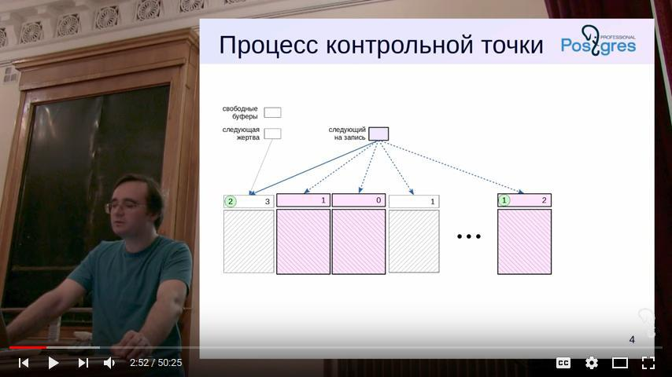

Когда происходит запись контрольной точки. В двух случаях
1. Когда размер журнала приближается к максимально допустимому `max_wal_size`
2. По истечении некоторого времени `checkpoint_timeout`

Когда это событие происходит
1. Помечаем все грязные буферы
2. Записываем помеченные буферы за `checkpoint_completion_target` от времени между контрольными точками (примерно)
3. Записать контрольную точку в файл `pg_control`

Настройки
- max_wal_size = 1GB (теперь с 9.5)
- checkpoint_segments = 3 (ранее в 9.4, один и тот же параметр)
- checkpoint_timeout = 5min
- checkpoint_completion_target = 0.5 (если время между записями контрольной точки = 5 минут,. то 2.5 минуты можно потратить на размеренную запись буферов)

Размер журнала должен поддерживаться в определенных границах
- минимальный - данные для восстановления и резерв места
- максимальный - зависит от частоты контрольных точек

Настройки
- min_wal_size = 80MB (9.5)
- max_wal_size = 1GB (9.5)
- checkpoint_segments = 3 (9.4)
- wal_keep_segments = 0

При настройке WAL есть выбор - можно делать контрольные точки _часто_, но тогда будет избыточный ввод-вывод, либо _редко_, тогда размер журнала будет больше и больше будет времени требоваться на восстановление работы.

мв можем посмотреть соклько журналв генерируется за какой промежуток времени и понимая ограничение может прикинуть как часто выполнять контрольные точки.

Мониторинг
- pg_stat_bgwriter представление, можно смотреть сколько по расписанию произошло, сколько вынужденных из за переполненного журнала
- log_checkpoints (пишет в жрунал инф о контрольной точке), checkpoint_warning (можно установить на какое то время, если точка будет выполняться раньше чем время то в лог будут сыпаться предупреждения) параметры

Далее процесс фоновой записи нужно настраивать чтобы он помогал контрольной точке работать.

Восстановление

При старте сервера запускается специальный процесс `startup` он заглядывает в файл `pg_control` и смотрит состояние кластера. Если все завершенео успешно, то будет написано `shut down`. Кластер был остановлен аккуратно. Если другое то нужно заниматься восстановлением.

1. Затем в этом же файле `pg_control` ищется последний LSN контрольной точки
2. Далее начинаем читать из журнала все записи по порядку начиная с этого LSN и начинаем их проигрывать. В записи есть страница к которой это изменение относится. Мы читаем эту страницу либо с диска либо из журнала и смотрим какой у этой страницы LSN. Если он меньше чем у LSN из журнала то эту запись надо применить. Таким образом в цикле догоняем каждую страницу до актуального состояния. Такая же ситуация с файлами.
3. Еще переисываем нежурналируемые таблицы init файлами. Таким образом все нежурналируемые и временные таблицы становятся пустыми.
4. После этого `startup` процесс завершается а постгрес выполняет контрольную точку чтобы зафиксировать состояние.

***
## 10. Файловая репликация

__Репликация__ это процесс синхронизации нескольких копий кластера баз данных на разных серверах

Задачи
- отказоустойчивость - при выходе из строя одного из серверов система должна сохранить доступность (возможна деградация производительности)
- масштабируемость - распределение нагрузки между серверами

Виды репликации
1. По роли серверов
    - мастер-реплика - поток данных в одну сторону
    - мастер-мастер - поток данных в обе стороны, возможны конфликты
2. По передаваемым данным
    Физическая | Логическаая |
    --- | :---: |
    |сегменты WAL (файловая) или записи WAL (потоковая)|команды SQL|
    |двоичная совместимость (на уровне железа и версии постгреса)|совместимость на уровне команд (на уровне команд)|
    |репликация всего кластера|возможна выборочная репликация (на уровне таблиц)|

> В постгресе пока нет репликации мастер-мастер и не реализована полноценная логическая репликация.

Физическое резервное копирование устроено следующим образом
- базовая резервная копия (по большому счету является копией файловой системы, весь каталог `$PG_DATA` копируется и называется базовой резервной копией) - `pg_basebackup`. Поскольку копирование файловой системы можно делать не выключая сервер то данные которые мы скопировали будут рассогласованными. Для восстановления согласованности необходим некий набор журналов, чтобы довести состояние страниц до согласованного состояния.
- журналы упреждающей записи - непрерывное архивирование (постоянное копирование сегментов журнала на другой сервер при каждом изменении)

Восстановление
1. Разворачиваем резервную копию
2. Создаем управляющий файл recovery.conf (содержится команда которая будет читать команды из журнала и архива) и запускаем сервер
3. Сервер восстанавливает согласованность, применяет остальные журналы и переходит в обычный режим работы

Процесс резервного копирования
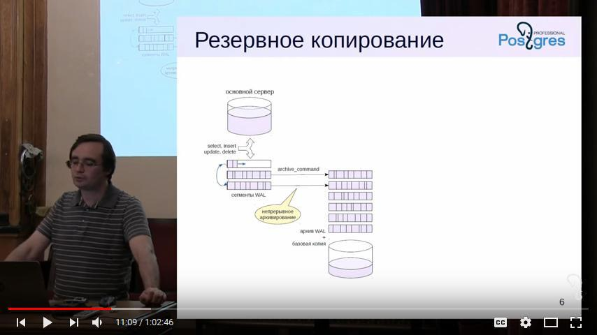

Произошла проблема и основной сервер погиб
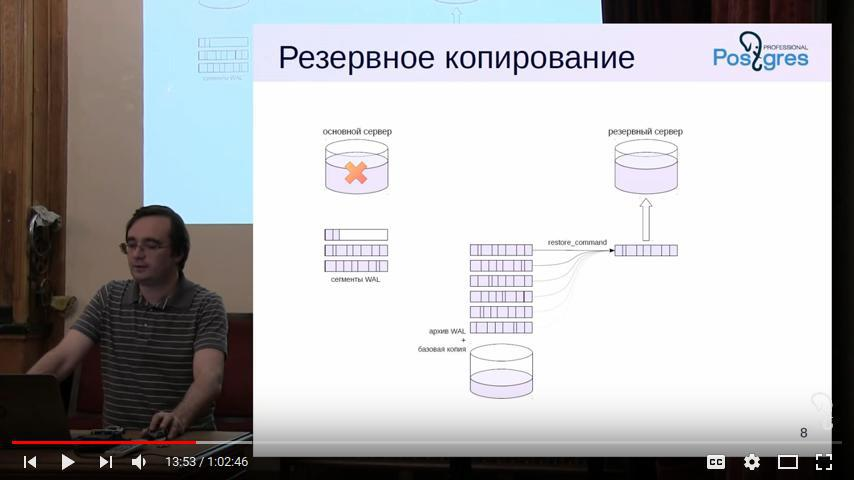

Чем отличается репликация (практически ничем), точно также берется базовая копия, точно также имеется архив сегментов, точно также копия разворачивается на другом сервере, но мы это делаем не дожидаясь пока с основным сервером что то случиться, а сразу. и в `recovery.conf` пишем специальные слова которые говорят серверу о том, что ему надо заниматься восстановлением непрерывно. Он догоняет основной сервер и ждет пока в архив не свалится очередной сегмент.

Кроме того такую реплику можно использовать в качестве горячего резерва. Если написать особые слова в `recovery.conf`, то реплика будет допускать к себе подключения, но эти подключения могут работать только на чтение.

Отличия этих двух серверов в наборе процессов

Мастер | Реплика |
--- | :---: |
|wal writer||
|autovacuum launcher||
|archiver (архивация)|startup process (восстановление)|
|checkpointer (контрольные точки)|checkpointer (точки рестарта)|
|writer|writer|
|stats collector|stats collector|

***
## 11. Потоковая репликация

__Потоковая репликация__ - реплика "догоняет" мастер, используя архив. затем получает поток записей WAL, не дожидаясь заполнения сегмента

Сравнение файловой и потоковой репликации

Трансляция файлов журнала | Потоковая репликация |
--- | :---: |
|вынужденное отставание реплики от мастера|отставание сведено к минимуму|
|мастер ничего не знает про реплику|есть возможность взаимодействия|

***
## 12. Переключение на реплику

***
## 13. Репликация: Варианты

***
## 14. Обработка запроса
Подходы к оптимизации:
1. Подстройка под существующую систему
    - настройка параметров
    - модернизация оборудования
    - репликация и распределение нагрузки
    - инструмент: мониторинг для выявления узких мест
2. Уменьшение нагрузки
    - поиск мест, где работа выполняется неэффективно
    - исправление с целью получить тот же результат меньшими ресурсами
    - инструмент: профилирование

Схема запроса
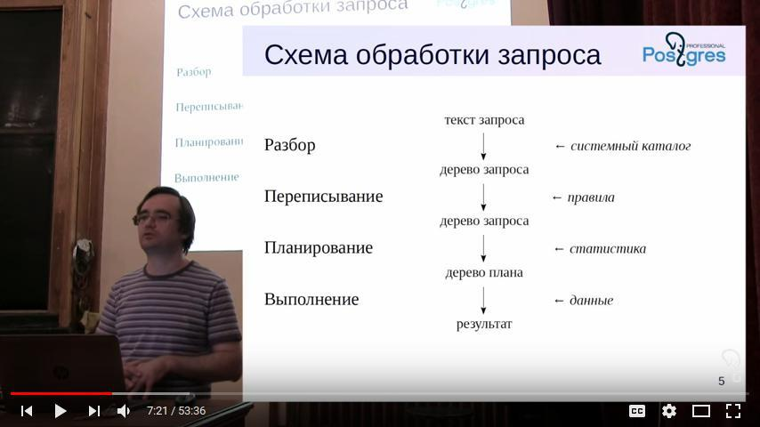

1. Синтаксический запрос (превращаем текст в некую структуру - дерево)
2. Семантический запрос (связать узлы дерева с реальными объектами - таблицами ит.д., проверяем права - информация берется из системных тфблиц)
3. Переписывание / Трансформация (пытаемся переписать дерево по некоторым правилам) Важный частный случай - это представление, потому что когда мы ссылаемся на представление, оно на этапе переписывания превращается в текст запроса. Так как мы получаем опять текст его опять надо превратить в дерево, и вставить в существующее дерево
4. Планирование (мы формулируем какой мы хотим получить результат). Планировщик перебирает все возможные способы выполнения запроса и каждый из этих способов оценивает. Тот план который получает наибольшую оценку считается оптимальным и передается на выполнение. Входными параметрами для планировщика является статистика. Получившееся дерево плана (отличается от дерева запроса) передается далее на выполнение
5. Выполнение. Мы идем по дереву и выполняем то что нарисовано. Получаем результат который отдаем клиенту.

Пример дерева синтаксического разбора
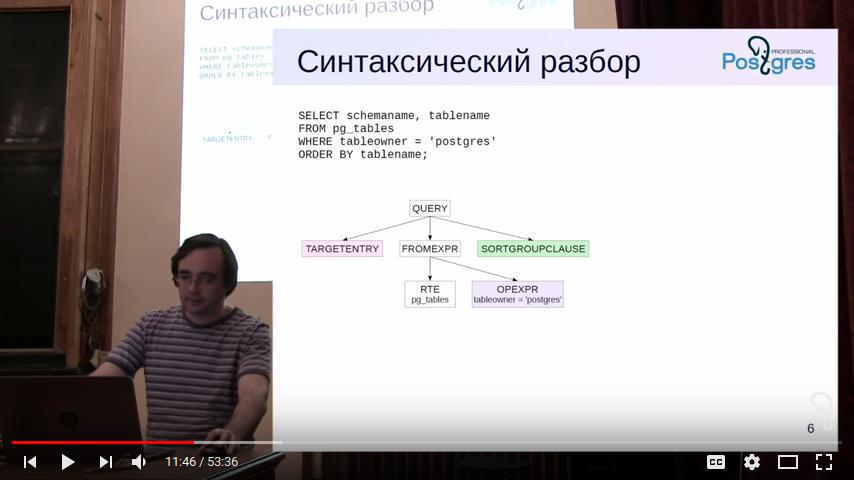
- TARGETENTRY список того что надо вернуть
- SORTGROUPCLAUSE попадает и order by

> При включенном параметре `debug_print_parse` можно увидеть синтаксически разобранный запрос. Практического смысла в этом особо нет

Пример дерева семантического разбора
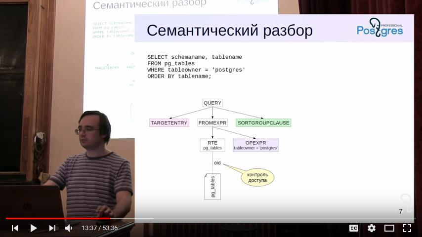
Здесь проверяется контроль доступа и выясняется что pg_tables это представление и происходит этап трансформации

Пример трансформации
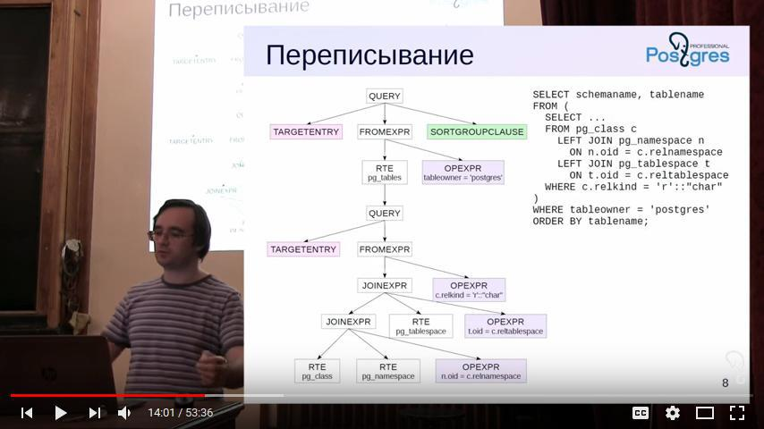

Далее наступает этап планирования (EXPLAIN). Это дерево отличается от синтаксического тем что тут впервые появляется конкретика, как мы будем этот запрос выполнять
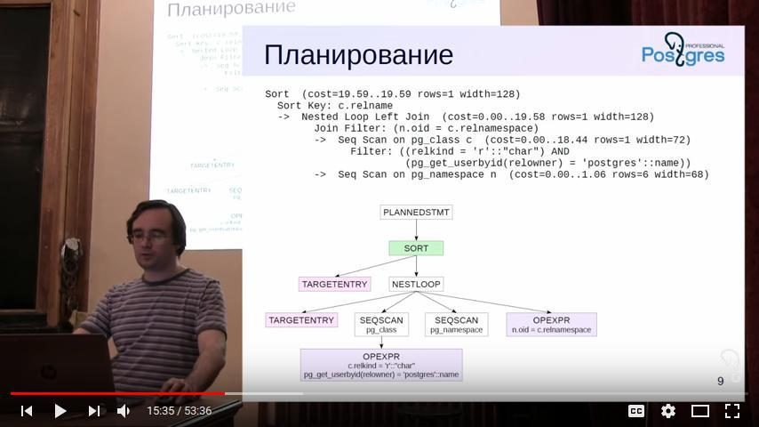

Этап выполнения
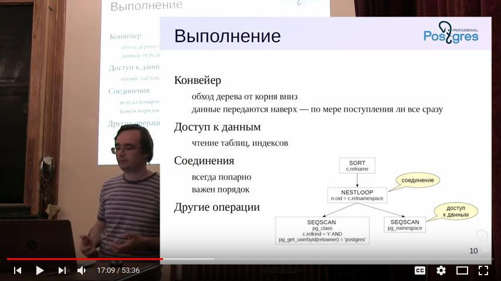
Планировщик умный и он может избавляться от некоторых таблиц в запросе, к примеру если в выводе нужны данные только из двух таблиц а третья таблица нужна только для левого джойна.

Фактически план выполнения это некий конвейер. Все начинается с самого верхнего узла - в данном случае это Sort, ему нужны какие то данные. Данных у него нет, он обращается к нижнему по ссылке узлу и говорит - дай мне данные и т.д. Когда доходит до узла которому получать данные уже неоткуда, он уже читает таблицу, отдает данные на уровень выше.

> Тонкий момент - некоторые узлы могут отдавать данные наверх постепенно, а некоторые должны сначала всю выборку получить а потом отдать. Например Sort это такой узел, чтобы что то отсортировать нужно сначала получить всю выборку.

Соединения в постгресе всегда выполняются попарно - сначала два источника, потом то что получилось с третьим и т.д. Так как выполняется попарно то очень важно в каком порядке все это соединять. По хорошему нужно соединять таблицы так чтобы как можно раньше отсекать те данные которые нам не нужны.

Подготовленные операторы

Разбор, трансформация, планирование происходят каждый раз когда мы посылаем в базу запрос. Чтобы сэкономить есть подготовленные операторы

Команда `PREPARE <имя> <параметры> AS <оператор>` выполняет разбор и переписывание, в ряде случаев - и оптимизацию, дерево запроса сохраняется в памяти процесса. Если разные процессы будут выполнять один и тот же запрос то он все равно будет разбираться заново для каждого процесса. Оптимизация в основном происходит когда у оператора нет параметров, тогда можно один раз оптимизировать и дальше выполнять. В таком случае запоминается уже план а не дерево разбора.

Команда `EXECUTE <имя> <параметры>` производит оптимизацию (как правило) и выполнение, а также гарантирует невозможность внедрения SQL-кода.

Параметры которые можно установить чтобы увидеть примерное время выполнения этапов обработки

```sql
alter system reset all;
alter system set log_parser_stats = on;
alter system set log_planner_stats = on;
alter system set log_executor_stats = on;
select pg_reload_conf();
```

Статистика синтаксического разбора `tail -n 45 ~/logfile | sed -n '/PARSER STATISTICS/,+8p'`
Статистика семантического разбора `tail -n 45 ~/logfile | sed -n '/PARSER ANALYSIS STATISTICS/,+8p'`
Статистика процесса трансформации `tail -n 45 ~/logfile | sed -n '/REWRITER STATISTICS/,+8p'`
Статистика этапа планирования `tail -n 45 ~/logfile | sed -n '/PLANNER STATISTICS/,+8p'`
Статистика этапа выполнения `tail -n 45 ~/logfile | sed -n '/EXECUTOR STATISTICS/,+8p'`

> нужно обращать внимание только на поле elapsed

И все вместе `tail -n 45 ~/logfile | sed -n '/^LOG\|elapsed/p'`

Пример подготовленного оператора

```sql
PREPARE stmt AS SELECT s, COUNT(*) FROM BIG GROUP BY s;
EXECUTE stmt;
```

Есть представление в котором можно посмотреть все подготовленные операторы
`select * from pg_prepared_statements;`

***
## 15. Методы доступа
Как постгрес читает данные из таблиц и индексов.

### Sequential Scan
__Последовательное сканирование__ = последовательно прочитать все страницы (в кэше использцется буферное кольцо), проверить видимость версий строк и получить данные

- эффективно для получения всех данных
- неэффективно для небольшой выборки

Таблица читается через буферный кэш, но через кольцо чтобы не вытеснять полезные данные. При индексном сканировании страница всегда попадает в общий буферный кэш и там оседает или вытесняется.

### index Scan
В постгресе индексы это вспомогательная структура во внешней памяти в которой сопоставляются ключи и идентификаторы строк таблицы (tuple id). Индексы используются для ускорения поиска и ограниченной целостности.

B-дерево это дерево поиска и оно обладает двумя свойствами
- оно сбалансированное (т.е. расстояние от дерева до листа всегда одинаковое)
- оно сильно ветвистое (не двоичное дерево) иисло веткей от корня определяется размером страницы. таким образом деревья не бывают глубокими, 4-5 уровней хватает за глаза для самых огромных таблиц

Есть ограничение которое накладывает b-дерево, оно может работать только с теми данными которые можно отсортировать, упорядочить, должны быть определены операции больше, меньше. Бывают данные которые отсортировать нельзя, например прямоугольники, поэтому для них используются другие типы дереьев и индексов.

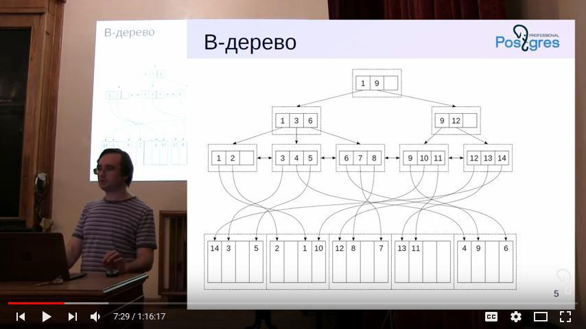

Внутри каждой страницы индекса данные упорядочены и листовые узлы дерева связаны двунаправленным списком, то есть по этим данным можно ходить налево и направо. Это значит то читая данные из индекса мы можем по листьям пройтись и получить данные отсортированными.

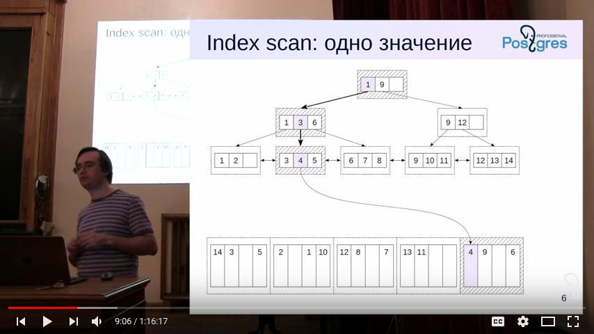
Видно как работает индекс по диапазонам. в корне идут диапахоны от 1-8 и 9-15, во втором уровне диапазоны 1-2, 3-5, 6-8, третий уровень уже листовая нода.

> Индексы не знают о видимости строк, так что ее нужно проверять отдельно, она есть только в самой странице.

С помощью индекса можно искать не только одно значение но и диапазон. Такие условия как x > или BETWEEN. После того как найдено первое значение начиются листаться ноды по возрастанию. Таким образом следующее значение не надо искать с вершины. Данные в индекс вставляются в уже упорядоченную последовательность в нужное место. если места между элементами нет для вставки нового элеменета индекса, то страница разрывыается пополам и в получившееся свободное место вставляется новое значение.
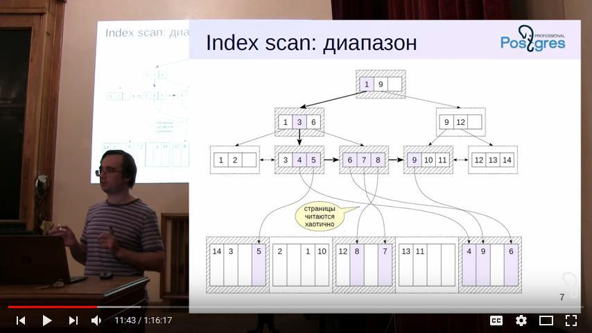

Получение одного значения - эффективно
- пройти от корня дерева до листовой страницы, найти в ней подходящий ключ
- прочитать страницу таблицы, проверить видимость версии строки таблицы и получить данные
Получение всех значений - не эффективно
- пройти от корня дерева до листовой страницы
- пройти все листовые страницы по ссылкам
- для каждого ключа прочитать соответствующую страницу таблицы, проверить видимость версии строки таблицы и получить данные
Проблема: хаотичное чтение страниц таблицы
    - одна и та же страница может читаться по нескольку раз

### Bitmap Scan
Сканирование битовой карты - дойдя до записи в листовом узле мы не бежим в таблицу искать строчки как при индексном сканировании а строим в памяти битовую карту и в этой карте отмечаем ту версию строки которую нам надо будет прочитать. На каждую версию строки один бит. Потом когда карта построена начинаем читать таблицу. Выйгрыш здесь в том что таблица читается последовательно и страница читается только один раз.


Такой скан эффективен для выборки среднего размера
- пройти от корня дерева до листовой страницы
- пройти необходимые листовые страницы по ссылкам
- построить в памяти битовую карту для всех найденных ключей
- последовательно прочитать страницы таблицы, отмеченные в битовой карте
- проверить видимость версий строк таблицы и получить данные

Есть нюанс - если в таблице данные упорядочены как в индексе, то необходимость в битовой карте пропадает. И посгрес это учитывает опираясь на статистику упорядоченности данных в таблице.

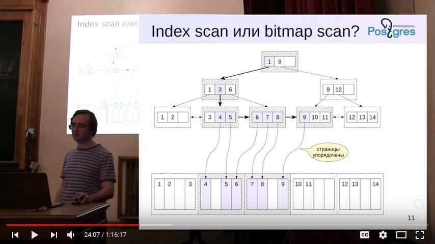

### Index Obly Scan
Допустим нужно получить данные которые уже содержатся в индексе. Индекс построен по столбцу и нам нужны данные только из этого столбца. Эти данные можно достать прямо из B-tree, поскольку эти данные являются ключами этого дерева.

Но в индексе нет информации о видимости, получить данные мы можем но понять видны они в текущем снапшоте или нет еще не можем. Чтобы это понять нужно идти в таблицу и смотреть xmin-xmax. А если идти в таблицу то смысла в оптимизации нет. Чтобы это работало в постгресе есть карта видимости (visibility map) в которой отмечены те страницы которые содержат те версии строк которые гарантировано видны во всех снапшотах. Это те страницы которые давно не обновлялись и вакуум вычистил из них старые данные. Единственно если tuple id не найден в карте видимости то все же придется идти в таблицу и проверять видимость строки.

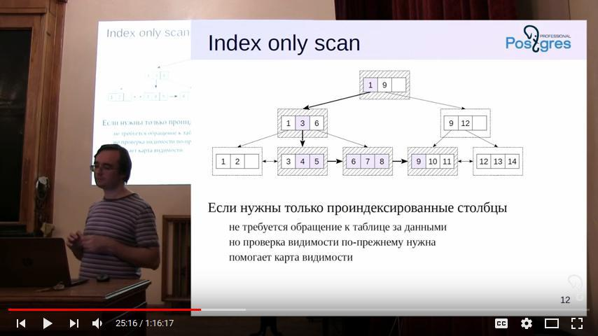

Практика. Подготовка данных
```sql
create table t(id integer, s text);
create index on t(id);
vacuum analyze t;
```

важные значения EXPAIN
- cost - оценка стоимости
- rows - оценка числа строк
- width - оценка размера одной записи в байтах

Стоимость указывается в неких условных единицах. Приводятся два числа: первое показывает оценку ресурсов на предварительную подготовку к операции, второе показывает общую оценку ресурсов для получения всех данных.

```
Index Scan using t_id_idx on t (cost=0.29..9.31 rows=1 width=1008)
    Index Cond: (id = 42)
    Filter: (s = 'abc'::text)
```
Тип сканирования (Index scan), имя индекса (t_id_idx), название таблицы (t). Ниже идет уровень доступа - то что постгрес ищет в индексе совпадение (id = 42), и фильтр того что постгрес ищет после того как получил данные от индекса. Эффективнее когда условие попадает только в индекс.

> Сравнивая выхлопы `EXPLAIN` и `EXPLAIN ANALYZE` можно узнать где оптимизатор ошибся в подсчетах.

```
Index scan using t_id_idx on t (cost=0.29..8.31 rows=1 width=1008) (actual time=3.890..3.890 rows=0 loops=1)
    Index Cond: (id = 42)
    Filter: (s = 'abs'::text)
    Rows removed by Filter: 1
Planning time: 0.085 ms
Execution time: 3.916 ms
```
Добавились актуальные значения
* time - время получения первой и последней строки выборки, тоже время на разогрев и выполнение
* rows - число строк (кардинальность)
* loops - число раз которое выполнялся этот шаг
Rows removed by Filter показывает реальное количество строк которые отсеяла 

```
Bitmap Heap Scan on t (cost=188.98..13896.66 rows=9895 width=1008)
    Recheck Cond: (id > 90000)
    -> Bitmap Index Scan on t_id_idx (cost=0.00..186.50 rows=9895 width=0)
        Index Cond: (id > 90000)
```
Выбран метод доступа Bitmap Scan. Он состоит из двух узлов - это дерево запроса, но пока в простом, линейном виде. Выолнение начинается сверху: узел bitmap Heap Scan обращается за данными ниже, к узлу Bitmap Index Scan.

Узел Bitmap Index Scan читает индекс, строит битовую карту и возвращает ее наверх. Карта должна быть построена полностью, прежде чем ее можно будет вернуть.

Узел Bitmap Heap Scan, получив карту, читает страницы таблицы. Это пример того как верхний узел не может не отпработать пока не закончит нижний. Это легко отследить если заметить что стоимость нижнего узла укзана за всю работу 186, а стоимость начала работы верхнего узла начинается со 188.

Когда мы строим битовую карту мы должны на каждую строку страницы выделить битик, но легко можно представить ситуацию когда страница очень большая и эти битики в памяти не поместится. Тогда постгрес начинает ее закруглять, перестает выдавать каждой строчке по битику а начинает выдавать каждой странице по битику. Используя такую карту постгрес может перебрать только страницы в которых есть нужные строки но чтобы взять нужные строки ему придется перепроверить индексное условие еще раз. Это и есть __Recheck Cond__.

> Даже если в памяти хватит места для битовой карты в плане постгрес все равно упомянет `Recheck Cond`, но не факт что будет его использовать.

Битовая карта еще хороша тем, что позволяет несколько условий объединить.

```
Bitmap Heap Scan on t (cost=191.61..13923.22 rows=9893 width=0)
    Recheck Cond: ((id > 95000) or (id < 5000))
    -> BitmapOr (cost=191.61..191.61 rows=9893 width=0)
        -> Bitmap Index Scan on t_id_idx (cost=0.00..92.86 rows=4875 with=0)
            Index Cond: (id > 95000)
        -> Bitmap Index Scan on t_id_idx (cost=0.00..93.93 rows=5018 width=0)
            Index Cond: (id > 5000)
```

Здесь сначала были построены две битовые карты - по одной на каждое условие а затем объединены побитовой операцией "или". Таким же образом могут быть использованы и разные индексы. 92 + 93 = 191, стоимость верхнего узла от 191

Кластеризация

Если строки таблицы упорядочены так же, как и индекс, битовая карта становится излишней. Есть команда которая позволяет данные в таблице переупорядочить. Это жестокая операция, ничем не лучше чем VACUUM FULL, но она есть. Нужно понимать что кластер - это эксклюзивная блокировка, а также что в процессе работы кдастеризация будет ухудшаться.
```sql
CLASTER t USING t_id_idx;
ANALYZE t;
```

Index Only

```
Index Only Scan using t_id_idx on t (cost=0.29..1716.99 rows=9983 width 4) (actual time=2.454..9.324 rows=10000 loops=1)
    Index Cond: (id > 90000)
    Heap Fetches: 10000
Planning time: 0.064 ms
Execution time: 9.703 ms
```
Строка __Heap Fetches__ показывает сколько строк было проверено с помощью таблицы. Для проверки видимости каждой строки постгрес лез в таблицу - итого 10 000 раз. Лучше чтобы было 0. Для этого надо не забыть запустить VACUUM

Другие способы доступа

Сканирование функции применяется если надо прочитать данные возвращаемые функцией. Можно считать его аналогом последовательного сканирования.

```
Function Scan on pg_lock_status l (cost=0.00..10.00 rows=1000 width=162)
```

```
explain select * from (values (1), (2), (3)) v;
---
Values Scan on "*VALUES*" (cost=0.00..0.04 rows=3 width=4)
```

Сканирование общего табличного значения (CTE, Common Table Expression) применяется при использовании фразы with

```
explain with a as (select * from t) select * from a;
---
CTE Scan on a (cost=15286..17286 rows=100000 width=36)
    CTE a
    -> Seq Scan on t (cost=0.00..15286.00 rows=100000 width=1008)
```
Надо заметить что подзапросы CTE всегда материализуются.

Сортировка и ограничение

Есть два способа выполнить сортировку. Первый - получить строки сканированием подходящего индекса: в этом случае данные автоматически будут отсортированы. `Index Scan using t_id_idx on t;`
Тот же самый индекс может использоваться и для сортировки в обратном порядке. `Index Scan Backward using t_id_idx on t`. В этом случае мы спускаемся от корня дерева к правому листовому узлу, и проходим по списку листовых страниц в обратном порядке.

Второй способ - выполнить последовательное сканирование таблицы и затем отсортировать полученные данные.

> Можно запретить индексный доступ командой `set enable_indexscan=off`

```
Sort (cost=67683.82..67933.82 rows=10000 width=1008)
    Sort Key: id
    -> Seq Scan on t (cost=0.00..15286.00 rows=100000 width=1008)
```

Для того, чтобы выполнить сортировку, надо получить весь набор данных. Это может оказаться неудачным, если в результате потребуется только часть выборки.

***
## Способы соединения

Соединения здесь не логические операции SQL (inner/left/right/full/cross) а физическая реализация в постгресе и механизм ее реализации. Не для каждой логической операции есть физическая реализация (может быть скомбинирована из нескольких простых) и не для всех логических операций существует одна физическая реализация.

Соединения всегда происходят попарно, постгрес не умеет одновременно соединять три таблицы и здесь важны два момента
- очень важен порядок в котором таблицы соединяются
- обычно важен и порядок внутри пары

Соединяем мы не таблицы а некоторые наборы строк, эти наборы могут приходить в том числе и из таблицы, но не обязательно. Соединяются уже отфильтрованные данные, иначе были бы лишние строки.

В постгресе есть три способа соединения

### Nested Loop
> __Вложенный цикл__ - для каждой строки одного набора перебираем подходящие строки другого набора.

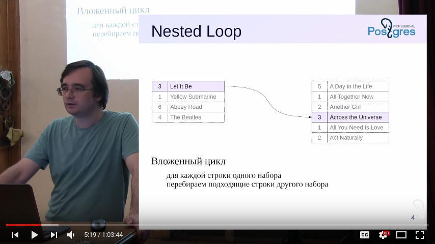

Вложенный цикл работает хорошо только на небольших объемах данных, либо если на второй таблице есть индекс по которому легко нацти совпадение. Очень часто используются друг с другом в мощной комбинации.

1. Это соединение не требует никакой подготовки, т.е может отдать результат без задержек по мере нахождения новых результатов
2. Это соединение эффективно для небольших выборок
    - хорошо когда внешний набор строк не очень велик
    - и к внутреннему набору есть эффективный доступ (обычно по индексу)
3. Сильно зависит от порядка соединения, лучше если левый набор меньше правого
4. Поддерживает соедиенния по любому условию - как эквисоединения, так и любые другие

### Hash Join
Соединение с использованием хэширования, в отличие от вложенного цикла происходит в два этапа - создание хэш-таблицы и осуществление выборки.

Если размер хэш таблицы подобран удачно, так чтобы в одной корзины было 1-2 значения, тогда можно обень быстро, почти за один шаг находить соответствия.

Строится хэш-таблица по левой таблице а затем перебираются строки в правой таблице, вычисляется хэш значения и оно ищется в хэш таблице, при совпадении результат возвращается.

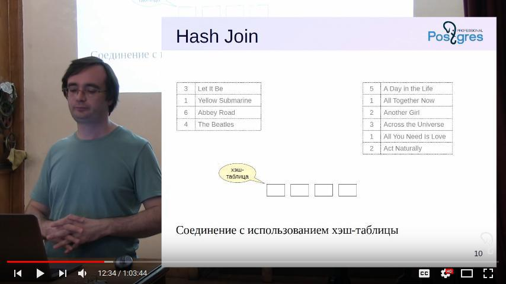

1. Требует подготовительных действий (надо построить хэш-таблицу)
2. Эффективен для больших выборок (так как требует подготовительных действий)
3. Зависит от порядка соединения
    - внутренний набор должен быть меньше внешнего чтобы минимизировать таблицу (так как она строится только по левой таблице)
4. Поддерживает только эквисоединения, больше или меньше для хэш-таблицы не имеет смысла

### Merge Join
Слияние предварительно отсортированных строк. Две табилцы сортируются и последовательно сравниваются строчка за строчкой. Идем подряд по двум наборам и только сдвигаем указатель. Эффективный и простой способ но требует сортировки.

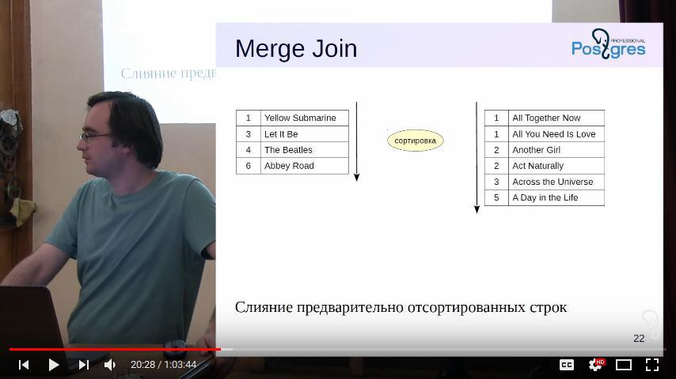

1. Требует подготовительных действий
    - надо отсортировать наборы строк
    - или получить их заранее отсортированными
2. Эффективен для больших выборок
    - предполагается полный перебор обоих наборов строк
    - хорошо, если наборы уже отсортированы
    - хорошо, если нужен отсортированный результат
3. Не зависит от порядка соединения
4. Поддерживает только эквисоединения, другие не реализованы но принципиальных ограничений нет

> Можно сказать что соединять любые большие наборы данных не по равенству это всегда тяжелая и очень мучительная операция

Модификации

Left (Right)
- возвращает строки даже если для _одного_ набора строк не нашлось соответствия в другом наборе
- sql `a left|right join b`

Full
- возвращает строки даже если для _любого_ набора строк не нашлось соответсвия в другом наборе
- только эквисоединение (соединение вложенных циклов не гарантирует просматр всех строчек, поэтому полное соединение сделать не может, поэтому полное соединение может быть сделано только через хэш или мерж а они не поддерживают ничего кроме эквисоединения)
- sql `a full join b`

Semi
- возвращает строки одного набора если только для них нашлось хотя бы одно соответствие в другом наборе
- sql `exists`

Anti
- возвращает строки одного набора, если только для них не нашлось соответствия в другом наборе
- sql `not exists`

```
Nested Loop ()
    -> Index Only Scan using a_id_idx on a ()
        Index Cond: ((id >= 41) AND (id <= 42))
    -> Index Scan using b_id_idx on b ()
        Index Cond: (id = a.id)
```
Узел Nested Loop обращается к первому дочернему узлу и просит выдать одну строку. Дочерний узел отрабатывает и возвращает строку (может оказаться что для этого придется выбрать все строки). Далее узел Nested Loop обращается к второму дочернему узлу, и просит выдать строки, соответствующие строке первого набора. И т.д.

```
-> Index Only Scan () (loops = 1)
-> Index Scan () (loops = 2)
```
Здесь `loops = 2` следует читать как то что пришлось два раза прочитать по 3 строки из таблицы

Обычно планировщие предпочитает Hash Join когда есть два набора данных и нет ограничения WHERE

```
Hash Join ()
    Hash Cond: (b.id - a.id)
    -> Seq Scan b ()
    -> Hash ()
        -> Seq Scan on a ()
```
Узел Hash Join начинает с того, что обращается к дочернему узлу Hash. Этот узел получает от своего дочернего узла весь набор строк и строит хэш-таблицу. Затем Hash-Join обращается ко второму дочернему узлу и соединяет строки, постепенно возвращая полученные результаты.

При такой записи `select * from a join b on (a.id=b.id and a.id + b.id < 100)` сначала построится соедиенение и только потом из него выкинутся сумма айди меньше 

Обычно оптимизатор предпочитает Merge Join когда нужно вернуть отсортированный результат. Для стимуляции выбора оптимизатором соединения слиянием можно дописать в запрос `order by` и есть индексы отсортированные. Иначе может попробовать хэш-соединение с последующей сортировкой.

Как и внутренний цикл соедиенение слиянием может отдавать результаты почти сразу.

Группировка и DISTINCT

Сгруппировать значения можно двумя вариантами
1. отсортировать и откинуть дубликаты
2. воспользоваться хэш-таблицей и убрать дубликаты м помощью нее

```
GroupAggregate ()
    Group Key: s
    -> Sort ()
        Sort Key: s
        -> Seq Scan on b ()
```
Для distinc план выглядит практически также
```
Unique ()
    -> Sort ()
        Sort Key: s
        -> Seq Scan on b ()
```
Побочный эффект такого способа выполнения состоит в том что результат также получается отсортированным. Но если результат должен быть отсортированным, лучше явно указывать order by

```
HashAggregate ()
    Group Key: s
    -> Seq Scan on b ()
```
В данном случае данные будут идти вразнобой.

Операции с множествами

Соедиения наборов строк всегда выполняются попарно, но в плане можно встретить узлы с тремя и более дочерними узлами. Это такие операции как Union, Except, Intersect.

```sql
explain select id from a union all select id from b union all select id from c;
---
Append ()
    -> Seq Scan on a ()
    -> Seq Scan on b ()
    -> Seq Scan on c ()
```

Это не значит что происходит одновременное объекдинение нескольких наборов стро - но в плане все операции собраны под одним родительским узлом.

***
## 17. Статистика
От чего зависит стоимость запроса. По большому счету стоимость зависит от числа строк с которыми надо работать. Оценка стоимости напрямую связана с оценкой кардинальности - т.е. количества строк которые будут обрабатываются.

Как понять сколько у нас будет строчек. Нужны во первых сведения о таблице - сколько строк суммарно в таблице и как данные распределены по столбцам. И нужны способы понять селективность условия, доля строк после того как мы их выбираем по условию. Высокая селективность означает что в выборке будет мало строк и наоборот. И нужны данные о том сколько будет строк после соединения двух таблиц.

И основная проблема когда статистика неправильно собирается, тогда считается неправильная стоимость, выбирается неправильный план.

### Оценка кардинальности
Как всегда с деревьями, это рекурсивная процедура. В самом низу плана находятся методы доступа. Чтобы оценить кардинальность метода доступа нужно знать размер исходной таблицы и селективность предикатов. Умножая одно на другое получаем кардинальность, результат. Если внизу кардинальности посчитаны далее вверху идут операции соединения или аггрегации. Имея два надора кардинальности далее рассчитывается кардинальность соединения - какая селективность будет у этого соединения и размеры соединяемых наборов строк. Оценки идут до тех пор пока не оценится кардинальность самого верхнего узла.

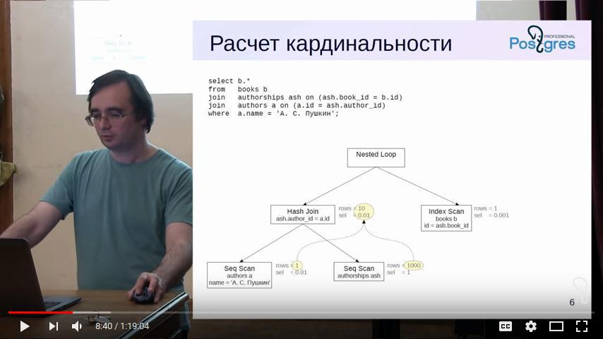

> Чем ниже по дереву случается ошибка подсчета кардинальности, тем хуже будет результат окончательного подсчета кардинальности

Оценка стоимости тоже рекурсивная процедура. Стоимость поддерева рассчитывает как сумма стоимости дочерних узлов и стоимости корневого узла поддерева. Стоимость узла зависит от типа узла и числа обрабатываемых строк (кардинальности) в меньшей степени зависит от других факторов.

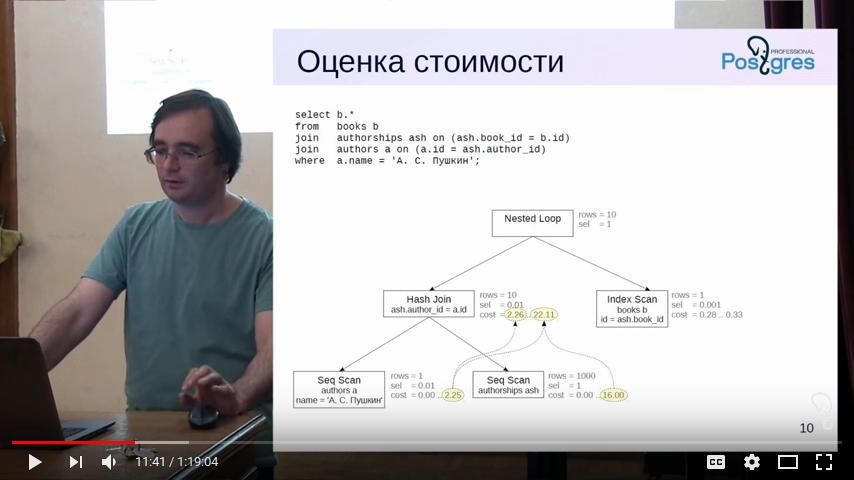

Как можно повлиять на вычисление стоимости. В постгресе есть модель как для каждого узла считать стоимость, есдинственно что можно сделать это отрегулировать несколько параметров которые задают стоимость некоторых элементарных операций. Дальше стоимость любого узла постгрес выражает в простых операциях и далее подсчитывает их сумму.

- seq_page_cost = 1.0 (стоимость чтения одной страницы данных при последовательном чтении)
- random_page_cost = 4.0 (стоимость чтения одной страницы данных при произвольной выборке) это наследие жестких дисков, если постгрес работает на ssd имеет смысл этот параметр уменьшить.

Эти параметры могут устанавливаться для табличных пространств так как табличные пространства как раз и существуют для того чтобы разнести данные по разным устройствам. `CREATE TABLESPACE ... WITH params=vals`

> Стоимость считается в пересчете на последовательное чтение одной страницы. Грубо говоря объем работы эквивалентный стольким-то страницам прочитанным последовательно.

Помимо дисковых операций есть еще работа процессора и ее постгрес тоже оценивает.
- cpu_tuple_cost = 0.01 (стоимость заглядывания в одну версию страницы)
- cpu_index_tuple_cost = 0.005 (стоимость чтения страницы в индексной странице, дешевле потому что там строчки попроще чем в таблицах)
- cpu_operator_cost = 0.0025 (стоимость работы операций =, >, <)

Можно для пользовательских функций задавать свою стоимость, если мы ее не задаем она будет по умолчанию. `CREATE FUNCTION ... COST стоимость (в единицах cpu_operator_cost)`

Выбор лучшего плана
- по возможности полный
- при большом числе вариантов - генетический алгоритм (GEQO), перебирает не все варианты но надеется что выбрал наболее близкий к оптимальному

Обычные запросы
- минимальная общая стоимость
- оптимизируется время получения всех строк результата, полной выборки

Если из курсора вычитываются результаты запроса
- минимальная стоимость для получения cursor_tuple_fraction строк из общей выборки
- минимизируется время получения части первых 

что входит в статистику
в таблице `pg_class` есть число строк которые входят в таблицу и число страниц которое занимает таблица. Она обновляется довольно часто, ее обновляет вакуум и аналайз, и при массовых операциях она обновляется.

Вся остальная статистика собирается по столбцу а не по таблице в целом. Эта статистика хранится в таблице `pg_statistic`. Чтобы туда смотреть более внятно есть представление `pg_stats`, в котором человеко-читаемо все.
- null_frac - доля неопределенных значений в столбце (от 0 до 1), сколько мы ожидаем найти нулов среди значений столбца
- n_distinct - число разных значений в данном столбце (если столбец boolian то будет в столбце значение 2)
- most_common_values - массив всех встречающихся значений
- most_common_freqs - коррелирующий массив с частотами встречаемости значений из первого массива. Если просуммировать все частоты то получится 1

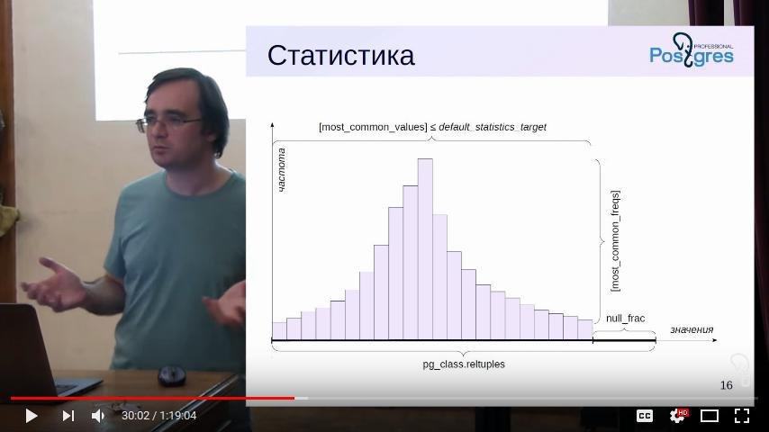

Это хорошо для небольших повторяющихся значений, но если их слишком много то вступает в силу параметр `default_statistics_target` который ограничивает длину такого массива. Что делает постгрес когда видит что в таблице много разных значений которые он не может себе позволить записать в массив. Тогда он переключается в гистограмму.

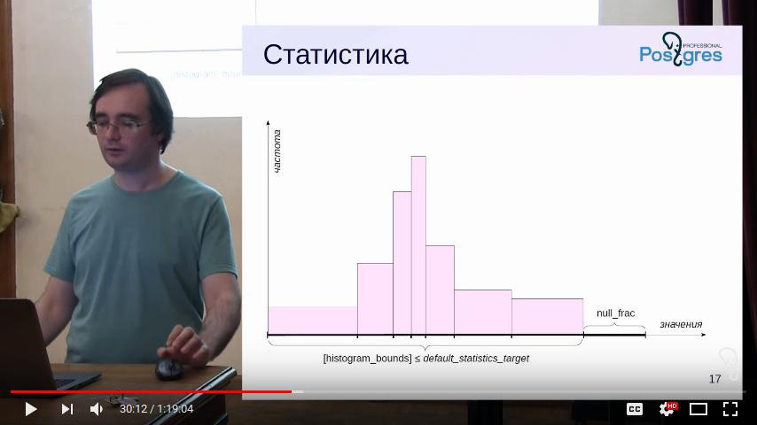

Выделяем какое-то количество корзин, примерно равное `default_statistics_target` и ширину этих корзин мы выбираем так чтобы в каждую корзину попало примерно одинаковое количество значений. В этом случае не надо хранить частоты, потому что ее можно вычислить.

Обычно же постгрес использует значения по частоте и гистограмму вместе

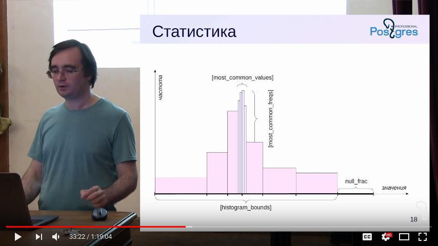

Дополнительные поля
- avg_width - средний размер строки в байтах
- correlation - упорядоченность значений на диске
    - 1 по возрастанию
    - 0 расположены хаотично
    - -1 по убыванию
    Как раз значение корреляции оптимизатор использует для того чтобы выбрать сканирование с помощью битовой карты или сканирование индекса. Если корреляция есть то предпочтет сканирование индекса

***
## 18. Использование памяти

1. Сортировка
    - order by, подготовка к соединению слиянием
    - группировка
    - создание индексов
2. Хэширование
    - соединение хэшированием
    - группировка
3. Временное хранение набора строк
    - результаты соединений
    - материализация CTE
    - оконные функции
4. Сканирование битовой карты

Ограничения

Оперативная память
- память каждой операции ограничена параметром work_mem
- при выполнении запроса несколько операций могут использовать память одновременно
- если выделенной памяти не хватает, используется диск (иногда операция может и превысить ограничение)
- больше памяти - быстрее выполнение
Дисковая память
- общая дисковая память сеанса ограничена параметром `temp_file_limit` (без учета временных таблиц)

***
## 19. Оптимизация запросов

Профилирование
- выделение подзадач
- продолжительность
- количество выполнений

Что оптимизировать
- чем больше доля подзадачи в общем времени выполнения, тем больше потенциальный выйгрыш
- необходимо учитывать затраты на оптимизацию
- полезно взглянуть на задачу шире

Журнал сообщений
- включается конфигурационными параметрами
    - log_min_duration_statements = 0 время и текст всех запросов
    - log_line_prefix - идентифицирующая информация
- сложно включить для отдельного сеанса
- большой объем, при увеличении порога времени теряем информацию
- не отслеживаются вложенные запросы (можно использовать расширение auto_explain)
- анализ внешними средствами, такими как `pgBadger`

Расширение `pg_stat_statements`
- подробная информация о запросах в представлении (в том числе о вложенных)
- ограниченный размер хранилища
- запросы считаются одинаковыми "с точностью до констант", даже если имеют разные планы выполнения
- идентификация только по имени пользователя и базе данных

Профиль запроса

Explain Analyze
explain.depesz.com
- подзадачи узлы плана
- продолжительность actual time
- количество выполнений loops

Особенности
- помимо наиболее ресурсоемких узлов, кандидаты на оптимизацию - узлы с большой ошибкой прогноза кардинальности
- любое вмешательство может привести к полной перестройки плана иногда приходится довольствоваться простым explain

Исправление неэффективностей
- каким-то образом найти и исправить узкое место
- бывает сложно догадаться, в чем проблема
- часто приводит к борьбе с планировщиком
Правильный рассчет кардинальности
- добиться правильного расчета кардинальности в каждом узле и положиться на планировщик
- если план все еще неадекватный, настраивать глобальные параметры

***
## 20. Секционирование
Секционирование - когда отдельные строки таблицы по ключу секционирования раскладываются по так называемым секциям. Приложение которое работает с таблицей может и не знать что она состоит из секций.
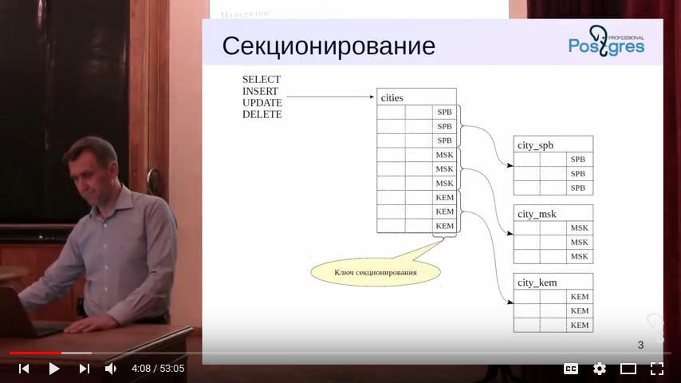
Задачи секционирования
1. Ускорение запросов, тогда планировщик исключает ненцжные секции
2. Удобство администрирования
    - задачи сопровождения: очистка, сбор статистики, переиндексация
    - использование разных табличных пространств для секций
    - включение/отключение секций

> Секции могут жить в разных табличных пространствах

За основу секционирования взят механизм табличного наследования

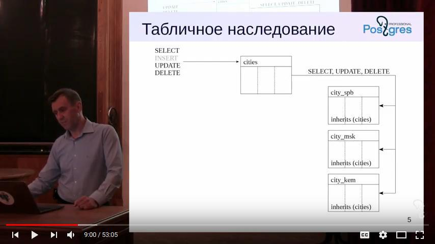

Определенная проблема есть с вставкой записей, необходимо труггер который будет в зависимости от ключа вставлять данные в дочернюю таблицу. В родительскую таблицу insert ничего не должен делать.
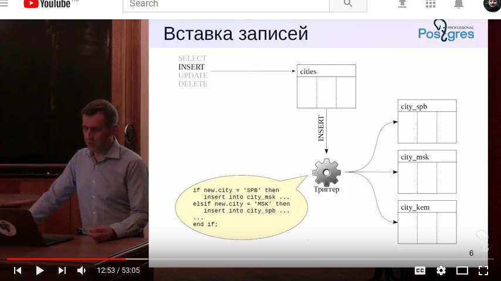

Комбинация табличного наследования, ограничения проверки и триггера на вставку это и есть механизм секционирования в постгресе.

***
## 21. Локализация

***
## 22. Обновление сервера

***
## 23. Управление расширениями

***
## 24. Внешние данные