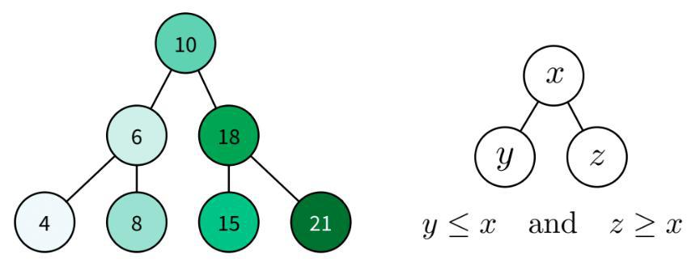
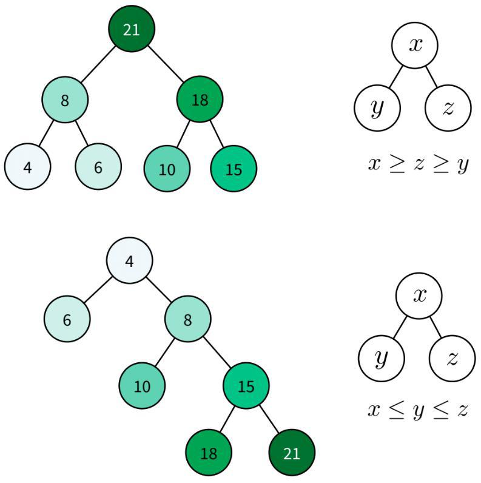

# General Programing

* [How recursion works - with flowcharts](https://medium.freecodecamp.org/how-recursion-works-explained-with-flowcharts-and-a-video-de61f40cb7f9)
* [10 Common data structures explained](https://medium.freecodecamp.org/10-common-data-structures-explained-with-videos-exercises-aaff6c06fb2b) 
* [Minimum every software developer absolutely, positively must know about Unicode and Character Sets](https://www.joelonsoftware.com/2003/10/08/the-absolute-minimum-every-software-developer-absolutely-positively-must-know-about-unicode-and-character-sets-no-excuses/)
* [Linked lists](https://dev.to/vaidehijoshi/linked-lists--basecs-video-series--2le8)

FIFO - First In First Out (used for Queues)
LIFO - Last In First Out (used in Stack)

## Dynamic programming

__Dynamic programming__ is identifying repeated subproblems in order to compute them only once. One common way to do this is a method similar to memorizing, with similar spelling. This trick for reusing partial calculations is called __memoization__.

## Queue
The Queue is the Stack’s antagonist. It’s also used for storing and retrieving items, but the retrieved item is always the one in front of the Queue, i.e., the one that has been on the queue the longest.

The Queue’s essential operations are:
- __enqueue(e)__: add an item __e__ to the back of the queue
- __dequeue()__: remove the item at the front of the queue

The Queue works by organizing data the __FIFO__ way (__F__irst-__I__n, __F__irst-__O__ut), because the first (and oldest) item that was inserted in the queue is always the first to leave the queue.

## Priority Queue
The Priority Queue is similar to the Queue, with the difference that enqueued items must have an assigned priority. The urgent cases receive top priority and go directly to the front of the queue, whereas the minor cases are added to the bottom of the queue. These are the Priority Queue’s operations:
- __enqueue(e, p)__: add an item __e__ to the queue according to the priority level __p__
- __dequeue()__: remove the item at the front of the queue and return it

## Binary Search Tree
A Binary Search Tree is a special type of Tree that can be efficiently searched. Nodes in Binary Search Trees can have at most two children. And nodes are positioned according to their value/key. Children nodes to the left of the parent must be smaller than the parent, children nodes to the right must be greater.

If the tree respects this property, it’s easy to search for a node with a given key/value within the tree.
To insert an item, we search the value we want to insert in the tree. We take the last node explored in that search, and make its right or left pointer point to the new node.

### Tree Balancing
If we insert too many nodes in a Binary Search Tree, we end up with a tree of enormous height, where many nodes have only one child. For example, if we insert nodes with keys/values always greater than the previous one, we end up with something that looks more like a Linked List. But we can rearrange nodes in a tree such that its height is reduced. This is called tree balancing. A perfectly balanced tree has the minimum possible height.

However, tree balancing is an expensive operation, as it requires sorting all nodes. Rebalancing a tree after each insertion or deletion can greatly slow down these operations. Usually, trees are undergo balancing after several insertions and deletions take place. But balancing the tree from time to time is only a reasonable strategy for trees that are rarely changed.

To efficiently handle binary trees that change a lot, __self-balancing binary trees__ were invented. Their procedures for in-serting or removing items directly ensure the tree stays balanced.

__The Red-Black Tree__ is a famous example of a self-balancing tree, which colors nodes either “red” or “black” for its balancing strategy.

Red-Black Trees are frequently used to implement Maps: the map can be heavily edited in an efficient way, and finding any given key in the map remains fast because of self-balancing.

__The AVL Tree__ is another breed of self-balancing trees. They require a bit more time to insert and delete items than Red-Black Trees, but tend to have better balancing. This means they’re faster than Red-Black Trees for retrieving items. AVL Trees are often used to optimize performance in read-intensive scenarios.

Data is traditionally stored in magnetic disks that read data in big chunks. In these cases, the __B-Tree__, a generalization of Binary Trees, is used. In B-Trees, nodes may store more than one item and can have more than two children, making it efficient to operate with data in big chunks. B-Trees are commonly used in database systems.

## Binary Heap

The Binary Heap is a special type of Binary Search Tree, in which we can find the highest (or smallest) item instantly. This data structure is especially useful for implementing Priority Queues. In the Heap it costs _O_(1) to get the maximum (or minimum) item, because it is always the Root Node of the tree. Searching or inserting nodes still costs _O_(log n). It has the same node placement rules as the Binary Search Tree, plus an extra restriction: a parent node must be greater (or smaller) than both its child nodes.

Remember to use the Binary Heap whenever you must frequently work with the maximum (or minimum) item of a set.

## Graph

The Graph is similar to the Tree. The difference is that there’s no children or parent nodes, and therefore, no Root Node. Data is freely arranged as nodes and edges, and any node can have multiple incoming and outgoing edges.

This is the most flexible data structure there is, and it can be used to represent almost any type of data. For example, graphs are ideal for representing a social network, where nodes are people and edges represent friendships.

## Hash Table

The Hash Table is a data structure that allows finding items in _O_(1) time. Searching for an item takes a constant amount of time, whether you’re searching among 10 million or just 10 items.

Similarly to the Array, the Hash requires preallocating a big chunk of sequential memory to store data. But unlike the Array, items are not stored in an ordered sequence. The position an item occupies is “magically” given by a hash function. That’s a special function that takes the data you want to store as input, and outputs a random-looking number. That number is interpreted as the memory position the item will be stored at.

This allows us to retrieve items instantly. A given value is first run through the hash function. The function will output the exact position the item should be stored in memory. Fetch that memory position. If the item was stored, you’ll find it there.

There is a problem with Hash Tables: sometimes the hash function returns the same memory position for two different inputs.

That’s called a __hash collision__. When it happens, both items have to be stored at the same memory address (for instance, by using a Linked List that starts at the given address). Hash collisions are an extra overhead of CPU and memory, so we try to avoid it.

A proper hash function will return random-looking values for different inputs. Therefore, the larger the range of values the hash function can output, the more data positions are available, and the less probable it is for a hash collision to happen. So we ensure at least 50% of the space available to the Hash Table is free. Otherwise, collisions would be too frequent, causing a significant drop in the Hash Table’s performance.

Hash Tables are often used to implement Maps and Sets. They allow faster insertions and deletions than tree-based data structures.

However, they require a very large chunk of sequential memory in order to work properly.