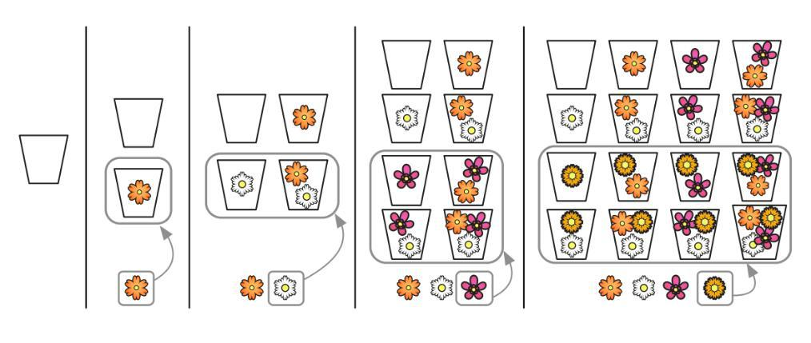
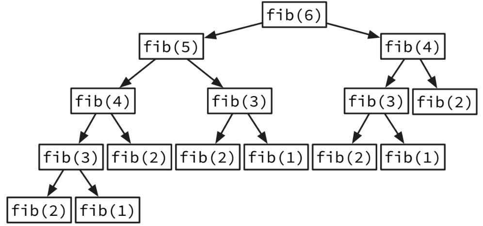
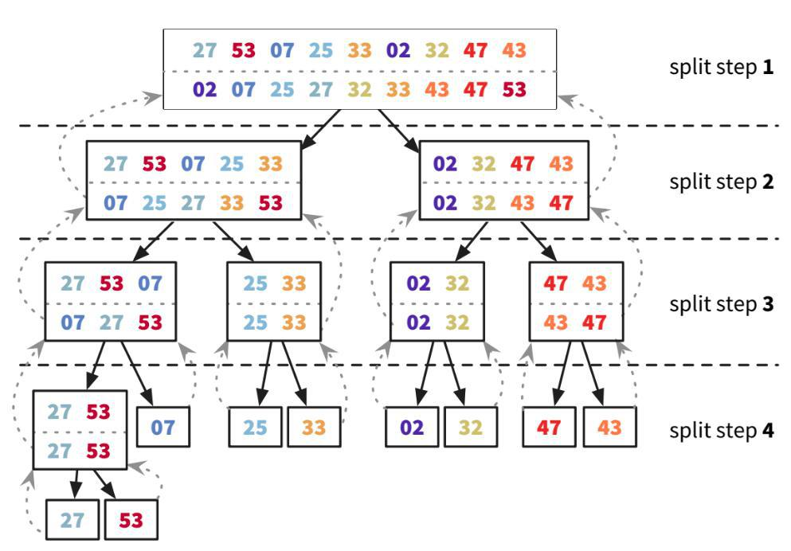
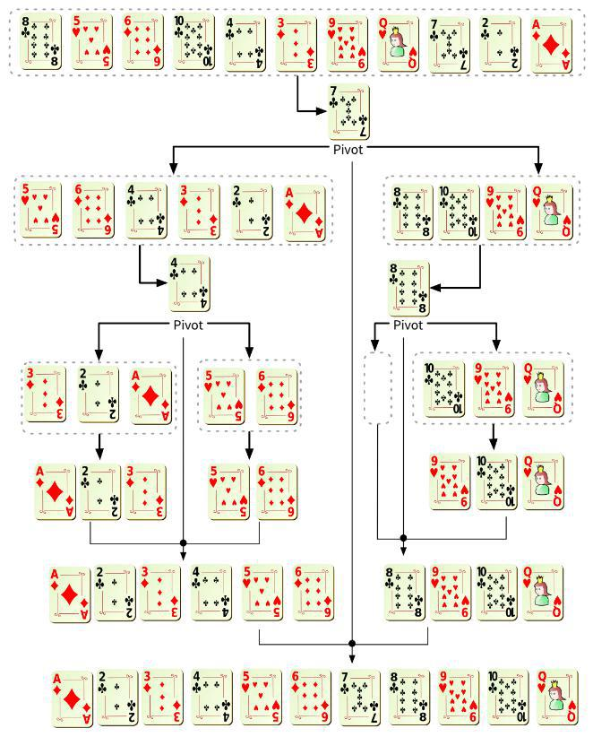
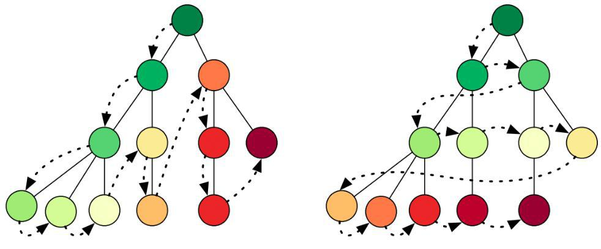

# 🤖 Algorithms

A method is a list of uambiguos instructions for achieving a goal. A method that always requires a finite series of operations is called an algorithm.

An algorithm is a set of instructions for accomplishing a task. Every piece of code could be called an algorithm, but this book covers the more interesting bits. I chose the algorithms in this book for inclusion because they’re fast, or they solve interesting problems, or both.

Some algorithms always run for a constant duration regardless of input size - they'r _O_(1)

Some algorithms are even worse than exponential time algorithms? whose time complexities are _O_(n!). Exponential and factorial time algorithms are horrible, but we need them for the hardest computational problems: the famous NP-complete problems.


The measure for the working storage an algorithm needs is called __space complexity__. Space complexity analysis is similar to time complexity analysis. The difference is that we count computer memory, and not computing operations. We observe how space complexity evolves when the algorithm’s input size grows, just as we do for time complexity.

So the maximum number of guesses is the same as the size of the list. This is called __linear time__.

Binary search is different. If the list is 100 items long, it takes at most 7 guesses. If the list is 4 billion items, it takes at most 32 guesses. Binary search runs in __logarithmic time__) (or __log time__, as the natives call it).

Human                | Notation       |
-------------------- | :------------: |
| constant time      | ___O_(1)__     |
| linear time        | ___O_(n)__     |
| log time   | ___O_(log n)__ |

Arrays vs Linked Lists vs Hash Tables

|           | Array | Linked List| Hash avg | Hash worst |
----------- | :---: | :--------: | :------: | :--------: |
| reading   | O(1)  | O(n)       | O(1)     | O(n)       |
| insertion | O(n)  | O(1)       | O(1)     | O(n)       |
| deletion  | O(n)  | O(1)       | O(1)     | O(n)       |

### Permutations
How permutations work


### Recursion


This simplicity comes at a price. Recursive algorithms spawn numerous clones of themselves when they run, introducing a computational overhead. The computer must keep track of unfinished recursive calls and their partial calculations, requiring more memory. And extra CPU cycles are spent to switch from a recursive call to the next and back.

### Brute Force
the number of pairs of days in an interval increases quadratically as the interval increases. Without writing the code, we’re already sure it must be _O_(n<sup>2</sup>).

### Backtracking
Backtracking works best in problems where the solution is a sequence of choices and making a choice restrains subsequent choices. It identifies as soon as possible the choices you’ve made cannot give you the solution you want, so you can sooner step back and try something else. _Fail early, fail often_.

### Heuristics
A heuristic method, or simply a heuristic, is a method that leads to a solution without guaranteeing it is the best or optimal one. Heuristics can help when methods like brute force or backtracking are too slow.

#### Greed
A very common heuristic approach to problems is the greedy approach. It consists in never coming back to previous choices. It’s the opposite of backtracking. Try to make the best choice at each step, and don’t question it later.

> A greedy algorithm is simple: at each step, pick the optimal move.

```python
states_needed = {"mt", "wa", "or", "id", "nv", "ut", "ca", "az"}
stations = {
    "kone": {"id", "nv", "ut"},
    "ktwo": {"wa", "id", "mt"},
    "kthree": {"or", "nv", "ca"},
    "kfour": {"nv", "ut"},
    "kfive": {"ca", "az"}
}
final_stations = set()

while_states_needed:
    best_station = None
    states_covered = set()
    for station, states_for_station in stations.items():
        covered = states_needed & states_for_station
        if len(covered) > len(states_covered):
            best_station = station
            states_covered = covered

states_needed -= states_covered
final_stations.add(best_station)

print final_stations
```

#### Divide and Conquer
You can crack problems using the same strategy, especially those with optimal substructure. Problems with optimal substructure can be divided into similar but smaller subproblems. They can be divided over and over until subproblems become easy.



Merge Sort’s time complexity is thus log<sub>2</sub>n x _O_(n) = _O_(n log n). That’s a huge improvement over the _O_(n<sup>2</sup>) Selection Sort.

For big inputs, _O_(n log n) algorithms in slow computers are much faster than _O_(n<sup>2</sup>) algorithms in 1000× faster computers.

D&C algorithms are recursive algorithms. According to D&C, with every recursive call, you have to reduce your problem.

To solve a problem using D&C, there are two steps:
1. Figure out the base case. This should be the simplest possible case.
2. Divide or decrease your problem until it becomes the base case.

## Sorting

### Selection Sort
The simpler sorting algorithms are _O_(n<sup>2</sup>). Selection Sort is one such algorithm. It’s the algorithm people tend to use for sorting a physical deck of cards. Selection Sort belongs to a big group of quadratic cost algorithms. We typically use them to sort small datasets of less than a thousand items.

```python
def find_smallest(arr):
    smallest = arr[0]
    smallest_index = 0
    for i in range(1, len(arr)):
        if arr[i] < smallest:
            smallest = arr[i]
            smallest_index = i
    return smallest_index

def selection_sort(arr):
    result = []
    for item in range(len(arr)):
        smallest = find_smallest(arr)
        result.append(arr.pop(smallest))
    return result

print selection_sort([5, 3, 6, 2, 10])
```

### Insertion Sort
One notable quadratic sorting algorithm is Insertion Sort. It’s very efficient at sorting nearly sorted datasets, even if they are huge. For inputs where a negligible number of items are out of order, insertion_sort is _O_(n). In this case, it does less operations than any other sorting algorithm.

### Quicksort and Merge Sort
For large datasets which aren’t nearly sorted, O(n<sup>2</sup>) algorithms are too slow (see tbl. 3.2). In these cases, we need more efficient algorithms. The most famous efficient sorting algorithms are Merge Sort and Quicksort, both _O_(n log n).

Both of this algorithms are also a D&C types, because they divide the problem on a smaller pieces.

#### Quicksort
> Quicksort is unique because its speed depends on the pivot you choose. In the worst case quicksort takes ___O_(n<sup>2</sup>)__ time as Selection Sort. But, in the average case it takes ___O_(n log n)__ time.

If Merge Sort is always takes __O_(n log n)__ time, why use Merge Sort?  Quicksort has a smaller constant than merge sort. So if they’re both O(n log n) time, quicksort is faster. And quicksort is faster in practice because it hits the average case way more often than the worst case.

If you’re implementing quicksort, choose a random element as the pivot. The average runtime of quicksort is O(n log n)!

1. Pick an element from the array. This element is called the pivot
2. Find the elements smaller than the pivot and the elements larger than the pivot. This is called _partitioning_. Now you have
    - A sub-array of all the numbers less than the pivot (not sorted yet)
    - The pivot
    - A sub-array og all the numbers greater than the pivot (not sorted yet)
3. Call quicksort recursively on the two sub-arrays



```python
def quicksort(arr):
    if len(arr) < 2:
        return arr  # Base case: arrays with o or 1 element are already "sorted"
    else:
        pivot = arr[0]
        lte = [i for i in arr[1:] if i <= pivot]
        gte = [i for i in arr[1:] if i > pivot]
        return quicksort(lte) + [pivot] + quicksort(gte)

print quicksort([10, 5, 2, 3])
```

## Search

### Sequential Search
The simplest search algorithm is Sequential Search: look at all items one after the other, until you find the one you want — or check all items to realize it’s not there.

It’s easy to see that Sequential Search is ___O_(n)__, where n is the total number of items in the search space.

### Binary Search
If your items are structured in a sorted array, we can also search them in ___O_(log n)__ time through __Binary Search__. This search process discards half the search space in each step.

Each step of binary_search does a constant number of operations and discards half the input. This means for n items, log<sub>2</sub>n steps fully reduce the input. As each step involves a fixed number of operations, the algorithm is ___O_(log n)__. You can search a million, or a trillion items, yet the search is still going to perform well.

Binary search always wanted sorted data for their input. In general, for any list of n, binary search will take log<sub>2</sub>n steps to run in the worst case, whereas simple search will take n steps.

```python
def binary_search(list, item):
    low = 0
    hight = len(list) - 1

    while low <= hight:
        mid = (low + hight)
        guess - list[mid]
        if guess == item:
            return mid
        if guess > item:
            high - mid - 1
        else:
            low = mid + 1
    return None

my_list = [1, 3, 5, 7, 9]
print binary_search(my_list, 3)  # 1
print binary_search(my_list, -1)  # None
```

### Hash Table
By storing your items in a Hash Table, you only need to calculate the hash of the key you are searching for. That hash gives the address of the item with the key! The time it takes to find an item does not increase when we increase the search space. It doesn’t matter if you’re searching among millions, billions or trillions of items—the number of operations is constant, meaning the process is ___O_(1)__ in time. Almost instant.

## Graphs
### Seraching in Graphs
There are two approaches: depth-first and breadth-first. They help to answer two types of questions:
- Is there a path from node A to node B?
- What is the shortest path from node A to node B



Searching a graph via __D__epth __F__irst __S__earch (__DFS__), we keep following edges, going deeper and deeper into the graph. When we reach a node that has no edges to any new nodes, we go back to the previous node and continue the process. We use a Stack to keep track of the exploration trail, pushing a node when we explore it, and popping a node when we need to go back.

If going deep in the graph isn’t a good approach, you can try __B__readth __F__irst __S__earch (__BFS__). It explores the graph level per level: first the neighbors of your start node, then its neighbors’ neighbors, and so on. To keep track of nodes to visit, we use a Queue. Once we explore a node, we enqueue its children, then dequeue the next node to explore.

Notice that DFS and BFS only differ in the way the next nodes to explore are stored: one uses a Queue, the other a Stack.

So which approach should we use? The DFS is simpler to implement and consumes less memory: you just need to store the parent nodes leading to the current node. In BFS you need to store the entire frontier of the search process. If you have a graph of million nodes, that might not be practical.

When you suspect the node you are searching isn’t many levels away from the start, it’s usually worth paying the higher cost of BFS, because you’re likely to find the node faster. When you need to explore all the nodes of a graph, it’s usually better to stick with DFS for its simple implementation and smaller memory footprint.

```python
# BFS Implementation
from collections import deque

def person_is_seller(name):
    return name[-1] == 'm'

graph = {
    "me": ["alice", "bob", "claire"]
    "alice": [],
    "bob": ["andy"],
    "claire": ["alice", "bob"]
}

def bfs_search(name):
    search_queue = deque()
    search_queue + graph[name]
    searched = []
    while search_queue:
        person = search_queue.popleft()
        if not person in searched:
            if person_is_seller(person):
                print person + " is a mango seller"
                return True
            else:
                search_queue += graph[person]
                searched.append(person)
    return False
```
BDF commonly written as __O(V + E)__ where V is number of vertices, E number of edges

> Tree is a special type of graph, where no edges ever point back

### Graph coloring
Graph Coloring problems arise when you have a fixed amount of “colors” (or any other set of labels), and you must assign each node in the Graph a color. Nodes that are connected with an edge cannot share the same color.

### Path Finding
Finding the shortest path between nodes is the most famous graph problem. Also known as _shortest-path problem_.

To find short paths, BFS and DFS strategies are usable but bad. One famous and very effective way of finding the shortest path is the __Dijkstra Algorithm__. As BFS uses an auxiliary Queue to keep track of nodes to explore, the Dijkstra Algorithm uses a Priority Queue. When new nodes are explored, their connections are added to the Priority Queue. A node’s priority is the weight of the edges that take it to the starting node. This way, the next node to explore is always the closest to where we started.

There are four steps to Dijkstra’s algorithm:

1. Find the “cheapest” node. This is the node you can get to in the least amount of time
2. Check whether there’s a cheaper path to the neighbors of this node. If so, update their costs
3. Repeat until you’ve done this for every node in the graph
4. Calculate the final path

```python
graph = {
    "start": {
        "a": 6,
        "b": 2
    },
    "a": {
        "fin": 1
    },
    "b": {
        "a": 3,
        "fin": 5
    },
    "fin": {}
}
infinity = float("inf")
costs = {
    "a": 6,
    "b": 2,
    "fin": infinity
}
parents = {
    "a": "start",
    "b": "start",
    "fin": None
}
processed = []

def find_lowest_cost_node(costs):
    lowest_cost = infinity
    lowest_cost_node = None
    for node in costs:
        cost = costs[node]
        if cost < lowest_cost and node not in processed:
            lowest_cost = cost
            lowest_cost_node = node
    return lowest_cost_node

node = find_lowest_cost_node(costs)
while node is not None:
    cost = costs[node]
    neighbors = graph[node]
    for n in neighbors.keys():
        new_cost = const + neighbors[n]
        if costs[n] > new_cost:
            costs[n] = new_cost
            parents[n] = node
    processed.append(node)
    node = find_lowest_cost_node(costs)
```

How to spot NP-complete problem:
- Your algorithm runs quickly with a handful of items but really slows down with more items.
- “All combinations of X” usually point to an NP-complete problem.
- Do you have to calculate “every possible version” of X because you can’t break it down into smaller sub-problems? Might be NP-complete.
- If your problem involves a sequence (such as a sequence of cities, like traveling salesperson), and it’s hard to solve, it might be NP-complete.
- If your problem involves a set (like a set of radio stations) and it’s hard to solve, it might be NP-complete.
- Can you restate your problem as the set-covering problem or the traveling-salesperson problem? Then your problem is definitely NP-complete

## K-nearest neighbors (KNN)
KNN is used for classification and regression and involves looking at the k-nearest neighbors.